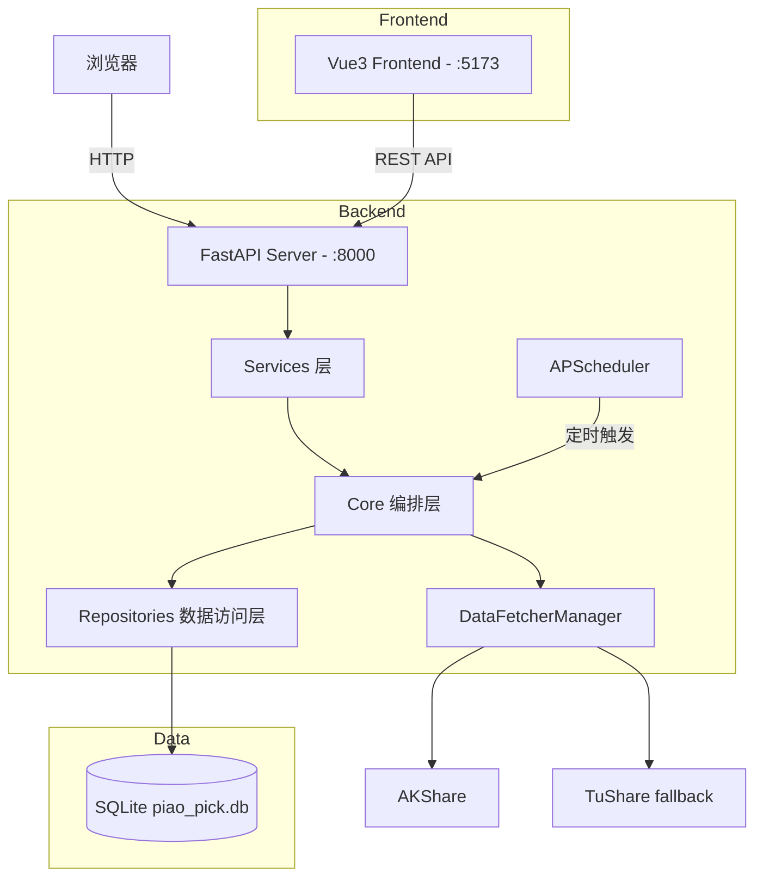
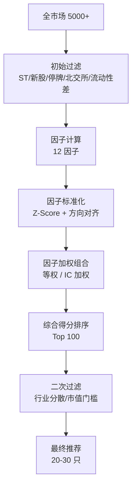

# 飘票选股系统 - 技术架构方案

> 版本: v2.0 | 日期: 2026-05-27
> 状态: 已审查通过 (Momus OKAY)
> 变更: 基于 `daily_stock_analysis` (DSA) 项目模式更新，复用其成熟的数据源管理、配置管理、交易日历、API 工厂、分层架构等设计。v1 已备份至 `.sisyphus/plans/technical-plan.v1.md`。

---

## 目录

0. [DSA 借鉴清单](#0-dsa-借鉴清单)
1. [系统定位与边界](#1-系统定位与边界)
2. [整体架构](#2-整体架构)
3. [技术栈](#3-技术栈)
4. [数据层设计](#4-数据层设计)
5. [选股引擎设计](#5-选股引擎设计)
6. [前端架构 (Vue3)](#6-前端架构-vue3)
7. [API 设计](#7-api-设计)
8. [开发路线图](#8-开发路线图)
9. [关键风险与缓解](#9-关键风险与缓解)
10. [目录结构](#10-目录结构)

---

## 0. DSA 借鉴清单

下表列出从 `daily_stock_analysis` 项目直接借鉴或复用的设计模式。每项均标注来源文件与复用方式。

| 模块 | 来源文件 | 复用方式 | 说明 |
|---|---|---|---|
| BaseFetcher 抽象基类 | `data_provider/base.py` | 复制 + 简化 | 定义统一 `_fetch_raw_data()` / `_normalize_data()` 接口 |
| DataFetcherManager | `data_provider/base.py` | 复制 + 简化 | 优先级排序 + 自动 failover，去掉美股/港股分支 |
| 标准化列名 | `data_provider/base.py` | 直接复用 | `STANDARD_COLUMNS` |
| 股票代码规范化 | `data_provider/base.py` | 复制 + 简化 | `normalize_stock_code()` / `canonical_stock_code()`，去掉 HK/US 分支 |
| Random Jitter 防封 | `data_provider/base.py` | 直接复用 | `BaseFetcher.random_sleep()` |
| 技术指标计算 | `data_provider/base.py` | 直接复用 | `_calculate_indicators()` (MA5/10/20, volume_ratio) |
| 数据清洁 | `data_provider/base.py` | 直接复用 | `_clean_data()` (日期格式/数值转换/去空/排序) |
| Config @dataclass 单例 | `src/config.py` | 复制 + 简化 | `@dataclass Config` + `get_config()` + `.env` 加载 |
| parse_env 工具函数 | `src/config.py` | 直接复用 | `parse_env_bool()` / `parse_env_int()` / `parse_env_float()` |
| ConfigIssue 验证 | `src/config.py` | 直接复用 | `validate() -> List[ConfigIssue]` |
| 交易日历 | `src/core/trading_calendar.py` | 复制 + 简化 | `exchange-calendars` 库，去掉港股/美股分支 |
| FastAPI 应用工厂 | `api/app.py` | 复制 + 简化 | `create_app()` + CORS + SPA fallback + 健康检查 |
| 分层架构 | `src/` 目录结构 | 设计理念复用 | core / services / repositories / schemas 四层 |
| Pydantic Schema | `src/schemas/report_schema.py` | 设计理念复用 | 嵌套结构 + Optional + `ConfigDict(extra="allow")` |
| YAML 策略格式 | `strategies/*.yaml` | 参考 + 改造 | 元数据字段参考 DSA，因子/过滤部分保持原设计 |
| Pipeline 中央调度 | `src/core/pipeline.py` | 设计理念复用 | `SelectionPipeline` 类比 `StockAnalysisPipeline` |
| 断点续传 | `src/core/pipeline.py` | 设计理念复用 | 检查数据库已有数据，跳过重复拉取/计算 |
| BacktestService | `src/services/backtest_service.py` | 设计理念复用 | 评估单个结果的模式 |

---

## 1. 系统定位与边界

### 1.1 一句话定义

飘票选股系统是一个**量化信号发现工具**：从 A 股全市场 5000+ 只股票中，按可量化的多因子规则，筛选出符合特定条件的候选股票池。

### 1.2 核心能力（做什么）

| 能力 | 说明 |
|---|---|
| 数据采集与管理 | 定时拉取行情/财务/资金数据，多数据源自动 failover，清洗对齐存储 |
| 多因子计算 | 12+ 因子的计算、标准化、截面排名 |
| 策略驱动选股 | YAML 声明式策略配置，不改代码即可调整策略 |
| 选股结果展示 | 表格 + 雷达图 + 行业分布，可视化辅助决策 |
| 简单回测 | 验证因子有效性，评估策略历史表现 |

### 1.3 不做的事

| 不做 | 原因 |
|---|---|
| 交易执行（下单/撤单/仓位） | 属于券商交易系统，不在选股范畴 |
| 实时毫秒级风控 | 选股是 T+1 日级决策支持，非高频场景 |
| 组合优化（均值-方差等） | 选股输出候选池，仓位分配是下一个环节 |
| 自动化信号推送 | MVP 阶段保持"系统筛，人确认"的模式 |
| AI/LLM 分析 | DSA 的特色，piao-pick 聚焦纯量化因子 |
| 多渠道通知 | MVP 不做，后期可借鉴 DSA 的 notifier 模式 |

### 1.4 典型用户场景

- **独立投资者**：周末 30 分钟，系统筛全市场，人工核查 20-30 只候选，确定下周关注池
- **量化爱好者**：有策略想法，快速验证因子有效性
- **小私募研究员**：每日更新股票池，替代手工筛选流程

---

## 2. 整体架构

### 2.1 架构风格：模块化单体 + 分层

不做微服务。采用 **core / services / repositories / schemas** 四层分离，借鉴 DSA 的分层模式。



### 2.2 分层职责

| 层 | 职责 | 目录 | 类比 DSA |
|---|---|---|---|
| **API** | REST 端点、请求解析、响应序列化 | `api/` | `api/v1/endpoints/` |
| **Services** | 业务编排、事务管理、跨模块协调 | `app/services/` | `src/services/` |
| **Core** | 核心算法、因子计算、选股引擎、回测引擎 | `app/core/` | `src/core/` |
| **Repositories** | 数据库 CRUD、SQL 查询封装 | `app/repositories/` | `src/repositories/` |
| **Schemas** | Pydantic 数据结构定义 | `app/schemas/` | `src/schemas/` |
| **Models** | ORM 模型（SQLModel） | `app/models/` | - |
| **Data Provider** | 数据源抽象、failover、标准化 | `app/data_provider/` | `data_provider/` |

### 2.3 数据流

```
15:00 收盘
    ↓
[DataFetcherManager] AKShare 拉取 → 失败则自动切换 TuShare
    ↓
[清洗] BaseFetcher._clean_data() 处理停牌/新股/复权
    ↓
[Repository] UPSERT 入 SQLite，断点续传检查已存在数据
    ↓
[Core/FactorPipeline] 全市场 12 因子计算，Z-Score 标准化
    ↓
[Core/SelectionEngine] 读取 YAML 策略配置，加权打分，过滤输出
    ↓
[Services] 结果入库 + 缓存
    ↓
[API] FastAPI 提供 REST 接口
    ↓
[前端] Vue3 展示结果表格 + 雷达图 + K 线图
```

---

## 3. 技术栈

### 3.1 前端

| 技术 | 版本 | 用途 |
|---|---|---|
| Vue 3 | 3.5+ | UI 框架，Composition API |
| TypeScript | 5.x | 类型安全 |
| Vite | 6.x | 构建工具 |
| TailwindCSS | v4 | 原子化样式 |
| Naive UI | 2.x | 组件库（dark mode 开箱即用） |
| vue-echarts | 7.x | ECharts Vue3 封装 |
| Vue Router | 4.x | 路由 |
| Pinia | 2.x | 状态管理 |
| @fontsource/geist | - | 字体自托管（数字等宽用 Geist Mono） |

### 3.2 后端

| 技术 | 版本 | 用途 | 来源 |
|---|---|---|---|
| Python | 3.11+ | 主要语言（量化生态） | - |
| FastAPI | 0.110+ | REST API 框架 | - |
| pandas + numpy | - | 数据处理核心 | - |
| scipy + statsmodels | - | 统计分析 | - |
| AKShare | 最新 | A 股数据源（主力） | - |
| TuShare | 最新 | A 股数据源（fallback） | - |
| SQLModel / SQLAlchemy | 2.0 | ORM | - |
| APScheduler | 3.x | 定时任务调度 | - |
| **exchange-calendars** | 最新 | **交易日历** (XSHG A 股) | **新增，借鉴 DSA** |
| **python-dotenv** | 最新 | **环境变量加载** | **新增，借鉴 DSA** |
| **PyYAML** | 最新 | **策略配置解析** | - |
| Pydantic | 2.x | 数据结构验证 | - |

### 3.3 数据存储

| 技术 | 用途 |
|---|---|
| SQLite | 关系数据 + 时序数据，单文件零部署 |
| Redis (可选) | 热数据缓存，MVP 先用 Python LRU |

### 3.4 部署

| 技术 | 用途 |
|---|---|
| Docker Compose | 容器化本地部署 |
| Nginx | 生产环境反向代理（可选） |

---

## 4. 数据层设计

### 4.1 DataFetcherManager 多数据源管理（借鉴 DSA）

#### 4.1.1 BaseFetcher 抽象基类

```python
# app/data_provider/base.py (复用 DSA 模式)

import logging
import random
import time
import pandas as pd
import numpy as np
from abc import ABC, abstractmethod
from datetime import datetime
from typing import Optional

logger = logging.getLogger(__name__)

# === 标准化列名定义 (直接复用 DSA) ===
STANDARD_COLUMNS = ['date', 'open', 'high', 'low', 'close', 'volume', 'amount', 'pct_chg']


class DataFetchError(Exception):
    """数据获取异常基类"""
    pass


class RateLimitError(DataFetchError):
    """API 速率限制异常"""
    pass


class BaseFetcher(ABC):
    """
    数据源抽象基类

    子类实现:
    - _fetch_raw_data(): 从具体数据源获取原始数据
    - _normalize_data(): 将原始数据转换为标准格式
    """

    name: str = "BaseFetcher"
    priority: int = 99  # 优先级数字越小越优先

    @abstractmethod
    def _fetch_raw_data(self, stock_code: str, start_date: str, end_date: str) -> pd.DataFrame:
        """从数据源获取原始数据"""
        pass

    @abstractmethod
    def _normalize_data(self, df: pd.DataFrame, stock_code: str) -> pd.DataFrame:
        """标准化数据列名"""
        pass

    def get_daily_data(
        self,
        stock_code: str,
        start_date: Optional[str] = None,
        end_date: Optional[str] = None,
        days: int = 30
    ) -> pd.DataFrame:
        """统一数据获取入口"""
        if end_date is None:
            end_date = datetime.now().strftime('%Y-%m-%d')
        if start_date is None:
            from datetime import timedelta
            start_dt = datetime.strptime(end_date, '%Y-%m-%d') - timedelta(days=days * 2)
            start_date = start_dt.strftime('%Y-%m-%d')

        request_start = time.time()
        logger.info(f"[{self.name}] 开始获取 {stock_code}: {start_date} ~ {end_date}")

        try:
            raw_df = self._fetch_raw_data(stock_code, start_date, end_date)
            if raw_df is None or raw_df.empty:
                raise DataFetchError(f"[{self.name}] {stock_code} 获取数据为空")
            df = self._normalize_data(raw_df, stock_code)
            df = self._clean_data(df)
            df = self._calculate_indicators(df)
            elapsed = time.time() - request_start
            logger.info(f"[{self.name}] {stock_code} 成功: rows={len(df)}, {elapsed:.2f}s")
            return df
        except Exception as e:
            elapsed = time.time() - request_start
            logger.error(f"[{self.name}] {stock_code} 失败: {e}, {elapsed:.2f}s")
            raise DataFetchError(f"[{self.name}] {stock_code}: {e}") from e

    def _clean_data(self, df: pd.DataFrame) -> pd.DataFrame:
        """数据清洗 (直接复用 DSA)"""
        df = df.copy()
        if 'date' in df.columns:
            df['date'] = pd.to_datetime(df['date'])
        numeric_cols = ['open', 'high', 'low', 'close', 'volume', 'amount', 'pct_chg']
        for col in numeric_cols:
            if col in df.columns:
                df[col] = pd.to_numeric(df[col], errors='coerce')
        df = df.dropna(subset=['close', 'volume'])
        df = df.sort_values('date', ascending=True).reset_index(drop=True)
        return df

    def _calculate_indicators(self, df: pd.DataFrame) -> pd.DataFrame:
        """计算技术指标 (直接复用 DSA)"""
        df = df.copy()
        df['ma5'] = df['close'].rolling(window=5, min_periods=1).mean()
        df['ma10'] = df['close'].rolling(window=10, min_periods=1).mean()
        df['ma20'] = df['close'].rolling(window=20, min_periods=1).mean()
        avg_volume_5 = df['volume'].rolling(window=5, min_periods=1).mean()
        df['volume_ratio'] = df['volume'] / avg_volume_5.shift(1)
        df['volume_ratio'] = df['volume_ratio'].fillna(1.0)
        for col in ['ma5', 'ma10', 'ma20', 'volume_ratio']:
            if col in df.columns:
                df[col] = df[col].round(2)
        return df

    @staticmethod
    def random_sleep(min_seconds: float = 1.0, max_seconds: float = 3.0) -> None:
        """防封禁: 随机延迟 (直接复用 DSA)"""
        sleep_time = random.uniform(min_seconds, max_seconds)
        time.sleep(sleep_time)
```

#### 4.1.2 DataFetcherManager 故障切换

```python
# app/data_provider/manager.py (简化版 DSA DataFetcherManager)

class DataFetcherManager:
    """
    数据源策略管理器
    - 按优先级排序
    - 自动故障切换 (Failover)
    - 统一数据获取接口
    """

    def __init__(self, fetchers=None):
        self._fetchers = []
        if fetchers:
            self._fetchers = sorted(fetchers, key=lambda f: f.priority)
        else:
            self._init_default_fetchers()

    def _init_default_fetchers(self):
        from .akshare_fetcher import AkshareFetcher
        from .tushare_fetcher import TushareFetcher

        akshare = AkshareFetcher()  # priority=0
        tushare = TushareFetcher()  # priority=1

        self._fetchers = sorted(
            [akshare, tushare],
            key=lambda f: f.priority
        )
        priority_info = ", ".join([f"{f.name}(P{f.priority})" for f in self._fetchers])
        logger.info(f"已初始化 {len(self._fetchers)} 个数据源: {priority_info}")

    def get_daily_data(self, stock_code, start_date=None, end_date=None, days=30):
        """
        获取日线数据 (自动切换数据源)

        Returns: Tuple[DataFrame, str] - (数据, 成功的数据源名称)
        """
        stock_code = normalize_stock_code(stock_code)
        errors = []

        for attempt, fetcher in enumerate(self._fetchers, start=1):
            try:
                logger.info(f"[数据源 {attempt}/{len(self._fetchers)}] [{fetcher.name}] {stock_code}")
                df = fetcher.get_daily_data(stock_code, start_date, end_date, days)
                if df is not None and not df.empty:
                    logger.info(f"[数据源完成] {stock_code} 使用 [{fetcher.name}]")
                    return df, fetcher.name
            except Exception as e:
                error_msg = f"[{fetcher.name}] {e}"
                logger.warning(f"[数据源失败 {attempt}] {error_msg}")
                errors.append(error_msg)
                continue

        raise DataFetchError(f"所有数据源获取 {stock_code} 失败:\n" + "\n".join(errors))

    def get_all_daily_data(self, trade_date, stock_codes=None):
        """批量获取全市场当日数据 (带 Jitter 防封)"""
        results = []
        for code in (stock_codes or get_all_stock_codes()):
            try:
                df, source = self.get_daily_data(code, days=1)
                results.append((df, source))
                BaseFetcher.random_sleep(0.1, 0.3)
            except Exception as e:
                logger.warning(f"[批量] {code} 失败: {e}")
        return results
```

#### 4.1.3 股票代码规范化（复用 DSA）

```python
# app/data_provider/base.py (简化版 DSA normalize_stock_code)

def normalize_stock_code(stock_code: str) -> str:
    """
    规范化股票代码 (复用 DSA 逻辑，仅保留 A 股部分)

    支持的格式:
    - '600519'      -> '600519'
    - 'SH600519'    -> '600519'
    - 'SZ000001'    -> '000001'
    - '600519.SH'   -> '600519'
    - '000001.SZ'   -> '000001'
    """
    code = stock_code.strip()
    upper = code.upper()

    # 去掉 SH/SZ 前缀
    if upper.startswith(('SH', 'SZ')) and not upper.startswith(('SH.', 'SZ.')):
        candidate = code[2:]
        if candidate.isdigit() and len(candidate) in (5, 6):
            return candidate

    # 去掉 .SH/.SZ 后缀
    if '.' in code:
        base, suffix = code.rsplit('.', 1)
        if suffix.upper() in ('SH', 'SZ', 'SS') and base.isdigit():
            return base

    return code


def canonical_stock_code(code: str) -> str:
    """规范化大小写 (复用 DSA)"""
    return (code or "").strip().upper()


def is_st_stock(name: str) -> bool:
    """检查是否为 ST 股票 (复用 DSA)"""
    return 'ST' in (name or "").upper()


def is_bse_code(code: str) -> bool:
    """北交所代码检查 (复用 DSA)"""
    c = (code or "").strip().split(".")[0]
    if len(c) != 6 or not c.isdigit():
        return False
    return c.startswith(("92", "43", "81", "82", "83", "87", "88"))
```

### 4.2 Config 配置管理（复用 DSA 模式）

```python
# app/config.py (复用 DSA Config 模式)

import logging
import os
from dataclasses import dataclass, field
from pathlib import Path
from typing import List, Literal, Optional
from dotenv import load_dotenv

logger = logging.getLogger(__name__)

@dataclass
class ConfigIssue:
    """配置验证问题 (直接复用 DSA)"""
    severity: Literal["error", "warning", "info"]
    message: str
    field: str = ""


def parse_env_bool(value: Optional[str], default: bool = False) -> bool:
    """解析布尔环境变量 (直接复用 DSA)"""
    if value is None:
        return default
    normalized = value.strip().lower()
    if not normalized:
        return default
    return normalized not in {"0", "false", "no", "off"}


def parse_env_int(value, default, *, field_name, minimum=None, maximum=None) -> int:
    """解析整数环境变量 (直接复用 DSA)"""
    if value is None or not str(value).strip():
        parsed = int(default)
    else:
        try:
            parsed = int(str(value).strip())
        except (TypeError, ValueError):
            logger.warning(f"{field_name}={value!r} 无效，使用默认值 {default}")
            parsed = int(default)
    if minimum is not None and parsed < minimum:
        parsed = minimum
    if maximum is not None and parsed > maximum:
        parsed = maximum
    return parsed


@dataclass
class Config:
    """全局配置单例 (复用 DSA 模式，简化版)"""
    _instance: Optional['Config'] = None

    # 数据库
    db_path: str = field(default_factory=lambda: os.getenv("DB_PATH", "data/piao_pick.db"))

    # 数据源
    tushare_token: str = field(default_factory=lambda: os.getenv("TUSHARE_TOKEN", ""))

    # 调度
    schedule_enabled: bool = field(default_factory=lambda: parse_env_bool(os.getenv("SCHEDULE_ENABLED"), True))
    schedule_time: str = field(default_factory=lambda: os.getenv("SCHEDULE_TIME", "15:30"))
    max_workers: int = field(default_factory=lambda: parse_env_int(os.getenv("MAX_WORKERS"), "4", field_name="MAX_WORKERS", minimum=1, maximum=16))

    # 选股
    selection_max_stocks: int = field(default_factory=lambda: parse_env_int(os.getenv("SELECTION_MAX_STOCKS"), "30", field_name="SELECTION_MAX_STOCKS"))

    # 策略目录
    strategies_dir: str = field(default_factory=lambda: os.getenv("STRATEGIES_DIR", "strategies"))

    # 日志
    log_dir: str = field(default_factory=lambda: os.getenv("LOG_DIR", "logs"))
    log_level: str = field(default_factory=lambda: os.getenv("LOG_LEVEL", "INFO"))

    def __post_init__(self):
        # 确保目录存在
        Path(self.db_path).parent.mkdir(parents=True, exist_ok=True)
        Path(self.log_dir).mkdir(parents=True, exist_ok=True)
        Path(self.strategies_dir).mkdir(parents=True, exist_ok=True)

    def validate(self) -> List[ConfigIssue]:
        issues = []
        db_parent = Path(self.db_path).parent
        if not db_parent.exists():
            issues.append(ConfigIssue("error", f"数据库目录不存在: {db_parent}", "DB_PATH"))
        if not self.tushare_token and not parse_env_bool(os.getenv("AKSHARE_ONLY"), False):
            issues.append(ConfigIssue("warning", "未配置 TUSHARE_TOKEN，数据源 fallback 不可用", "TUSHARE_TOKEN"))
        return issues

    @classmethod
    def get_instance(cls) -> 'Config':
        if cls._instance is None:
            load_dotenv()
            cls._instance = cls()
        return cls._instance

    @classmethod
    def reset_instance(cls):
        cls._instance = None


def get_config() -> Config:
    return Config.get_instance()
```

#### .env.example

```ini
# 数据库
DB_PATH=data/piao_pick.db

# 数据源
TUSHARE_TOKEN=

# 调度
SCHEDULE_ENABLED=true
SCHEDULE_TIME=15:30
MAX_WORKERS=4

# 选股
SELECTION_MAX_STOCKS=30
STRATEGIES_DIR=strategies

# 日志
LOG_DIR=logs
LOG_LEVEL=INFO
```

### 4.3 交易日历（复用 DSA，仅 A 股）

```python
# app/core/trading_calendar.py (简化版 DSA，仅保留 cn 市场)

import logging
from datetime import date, datetime
from typing import Set
from zoneinfo import ZoneInfo

logger = logging.getLogger(__name__)

# exchange-calendars 可用性检测 (复用 DSA)
_XCALS_AVAILABLE = False
try:
    import exchange_calendars as xcals
    _XCALS_AVAILABLE = True
except ImportError:
    logger.warning("exchange-calendars 未安装。运行: pip install exchange-calendars")

# A 股市场映射 (简化版 DSA)
MARKET_EXCHANGE = {"cn": "XSHG"}
MARKET_TIMEZONE = {"cn": "Asia/Shanghai"}


def get_market_now(current_time=None) -> datetime:
    """获取当前 A 股市场本地时间 (复用 DSA get_market_now)"""
    tz = ZoneInfo("Asia/Shanghai")
    if current_time is None:
        return datetime.now(tz)
    if current_time.tzinfo is None:
        return current_time.replace(tzinfo=tz)
    return current_time.astimezone(tz)


def is_market_open(check_date: date) -> bool:
    """
    判断 A 股是否交易日 (复用 DSA is_market_open, fail-open)
    """
    if not _XCALS_AVAILABLE:
        return True  # fail-open
    try:
        cal = xcals.get_calendar("XSHG")
        session = datetime(check_date.year, check_date.month, check_date.day)
        return cal.is_session(session)
    except Exception as e:
        logger.warning(f"trading_calendar.is_market_open fail-open: {e}")
        return True


def get_effective_trading_date(current_time=None) -> date:
    """
    获取最新可复用的交易日日期 (复用 DSA 逻辑)
    - 非交易日: 返回前一个交易日
    - 交易日盘前: 返回前一个交易日
    - 交易日盘后: 返回当日
    """
    market_now = get_market_now(current_time)
    fallback = market_now.date()

    if not _XCALS_AVAILABLE:
        return fallback

    try:
        cal = xcals.get_calendar("XSHG")
        local_date = market_now.date()

        if not cal.is_session(local_date):
            return cal.date_to_session(local_date, direction="previous").date()

        session = cal.date_to_session(local_date, direction="previous")
        session_close = cal.session_close(session)
        if hasattr(session_close, "tz_convert"):
            close_local = session_close.tz_convert("Asia/Shanghai").to_pydatetime()
        elif session_close.tzinfo is not None:
            close_local = session_close.astimezone(ZoneInfo("Asia/Shanghai"))
        else:
            close_local = session_close.replace(tzinfo=ZoneInfo("Asia/Shanghai"))

        if market_now >= close_local:
            return session.date()
        return cal.previous_session(session).date()

    except Exception as e:
        logger.warning(f"trading_calendar.get_effective_trading_date fail-open: {e}")
        return fallback


def get_trade_dates_between(start_date: str, end_date: str) -> list:
    """获取区间内所有交易日列表"""
    if not _XCALS_AVAILABLE:
        # fallback: 简单估算 (工作日)
        from datetime import timedelta
        start = date.fromisoformat(start_date)
        end = date.fromisoformat(end_date)
        return [d for d in (start + timedelta(days=i) for i in range((end - start).days + 1))
                if d.weekday() < 5]
    cal = xcals.get_calendar("XSHG")
    sessions = cal.sessions_in_range(start_date, end_date)
    return [s.date() for s in sessions]
```

### 4.4 数据库 Schema

#### 4.4.1 股票基础信息

```sql
CREATE TABLE stock_info (
    ts_code      TEXT PRIMARY KEY,   -- '000001.SZ'
    name         TEXT,               -- '平安银行'
    industry     TEXT,               -- '银行' (申万一级行业)
    list_date    TEXT,               -- 上市日期 'YYYY-MM-DD'
    is_st        INTEGER DEFAULT 0, -- 是否 ST/ *ST
    is_suspended INTEGER DEFAULT 0, -- 是否停牌
    updated_at   TEXT               -- 最后更新时间
);
```

#### 4.4.2 日 K 线数据

```sql
CREATE TABLE kline_daily (
    ts_code      TEXT NOT NULL,
    trade_date   TEXT NOT NULL,
    open         REAL,
    high         REAL,
    low          REAL,
    close        REAL,
    volume       INTEGER,           -- 成交量 (股)
    amount       REAL,              -- 成交额 (元)
    close_adj    REAL,              -- 前复权价
    adj_factor   REAL,              -- 复权因子
    is_limit_up  INTEGER DEFAULT 0, -- 涨停
    is_limit_down INTEGER DEFAULT 0,-- 跌停
    ma5          REAL,              -- MA5 (由 BaseFetcher 计算)
    ma10         REAL,              -- MA10
    ma20         REAL,              -- MA20
    volume_ratio REAL,              -- 量比
    data_source  TEXT,              -- 数据来源 (akshare/tushare)
    PRIMARY KEY (ts_code, trade_date)
);

CREATE INDEX idx_kline_date ON kline_daily(trade_date);
CREATE INDEX idx_kline_code ON kline_daily(ts_code);
```

#### 4.4.3 日因子数据

```sql
CREATE TABLE factor_daily (
    ts_code        TEXT NOT NULL,
    trade_date     TEXT NOT NULL,
    -- 估值因子
    pe_ttm         REAL,
    pb             REAL,
    ps_ttm         REAL,
    fcf_yield      REAL,
    -- 动量因子
    ret_20d        REAL,
    ret_60d_vol    REAL,
    turnover_20d   REAL,
    -- 质量因子
    roe_ttm        REAL,
    gross_margin   REAL,
    -- 成长因子
    rev_growth_yoy REAL,
    ear_growth_yoy REAL,
    -- 其他
    ln_market_cap  REAL,
    inst_holding_chg REAL,
    extra          JSON,
    PRIMARY KEY (ts_code, trade_date)
);

CREATE INDEX idx_factor_date ON factor_daily(trade_date);
```

#### 4.4.4 选股策略

```sql
CREATE TABLE strategies (
    id           TEXT PRIMARY KEY,  -- UUID
    name         TEXT,              -- '价值低波'
    display_name TEXT,              -- '价值低波' (借鉴 DSA)
    description  TEXT,
    category     TEXT,              -- 'value'/'momentum'/'blended' (借鉴 DSA)
    config       TEXT NOT NULL,     -- YAML 配置内容
    is_active    INTEGER DEFAULT 1,
    priority     INTEGER DEFAULT 50,-- 执行优先级 (借鉴 DSA default_priority)
    created_at   TEXT,
    updated_at   TEXT
);
```

#### 4.4.5 选股结果

```sql
CREATE TABLE selection_results (
    strategy_id     TEXT,
    ts_code         TEXT,
    trade_date      TEXT,
    rank            INTEGER,
    composite_score REAL,
    status          TEXT,             -- 'OK', 'LIMIT_UP', 'SUSPENDED'
    factor_snapshot JSON,
    created_at      TEXT,
    PRIMARY KEY (strategy_id, ts_code, trade_date),
    FOREIGN KEY (strategy_id) REFERENCES strategies(id)
);
```

### 4.5 数据更新流程

```python
# app/services/data_service.py

class DataService:
    """数据服务层 (借鉴 DSA Pipeline 模式)"""

    def __init__(self, config=None, fetcher_manager=None):
        self.config = config or get_config()
        self.fetcher_manager = fetcher_manager or DataFetcherManager()
        self.db = get_db()

    async def daily_update(self, trade_date: str = None):
        """每日更新管道"""
        if trade_date is None:
            trade_date = get_effective_trading_date().isoformat()

        if not is_market_open(date.fromisoformat(trade_date)):
            logger.info(f"{trade_date} 非交易日，跳过")
            return

        # Step 1: 全量拉取当日行情 (带 Jitter 防封)
        logger.info(f"[日更新] {trade_date} 开始拉取全市场行情")
        all_stock_codes = self.db.get_all_stock_codes()
        kline_results = self.fetcher_manager.get_all_daily_data(
            trade_date, stock_codes=all_stock_codes
        )

        # Step 2: 数据校验
        if len(kline_results) < 4800:
            logger.error(f"数据量异常: {len(kline_results)} 条 (预期 >= 4800)")
            raise DataFetchError("全市场数据量异常")

        # Step 3: 清洗 + UPSERT (断点续传: 跳过已有数据)
        upsert_count = 0
        for df, source in kline_results:
            if self.db.has_kline_data(df.iloc[0]['ts_code'], trade_date):
                continue  # 断点续传 (借鉴 DSA)
            upsert_count += self.db.upsert_kline_daily(df, source)
        logger.info(f"[日更新] UPSERT {upsert_count} 条 K 线")

        # Step 4: 因子全量重算 (当日截面)
        logger.info(f"[日更新] 计算全市场因子")
        factors = self.compute_all_factors(trade_date)
        self.db.upsert_factor_daily(factors)

        # Step 5: 触发所有活跃策略
        for strategy in self.db.get_active_strategies():
            results = self.run_strategy(strategy, trade_date, factors)
            self.db.save_selection_results(results)

        # Step 6: 异常检测
        self.validate_data_integrity(trade_date)
        logger.info(f"[日更新] {trade_date} 完成")
```

### 4.6 数据清洗铁律

| 规则 | 处理方式 |
|---|---|
| 复权 | 统一使用**前复权** (close_adj) |
| 停牌 | open=high=low=close=前日收盘价, 标记 `is_suspended=1` |
| ST 标记 | `stock_info.is_st=1`, 策略默认排除 |
| 新股剔除 | 上市不满 60 个交易日，不参与因子排名 |
| 涨跌停 | 标记 flag，选股结果标注"不可买入" |
| PE<0 (亏损) | 不参与 PE 截面排名，单独分类 |
| 未来数据 | 严格使用 `trade_date` 为截止点，不使用未来发布的财报 |
| 北交所排除 | `is_bse_code()` 检测，策略默认排除 |

---

## 5. 选股引擎设计

### 5.1 SelectionPipeline 中央调度（借鉴 DSA Pipeline）

```python
# app/core/pipeline.py

class SelectionPipeline:
    """
    选股主流程调度器 (类比 DSA StockAnalysisPipeline)

    职责:
    1. 协调数据获取、因子计算、策略执行
    2. 并发控制和异常处理
    3. 断点续传支持
    """

    def __init__(self, config=None, max_workers=None, progress_callback=None):
        self.config = config or get_config()
        self.max_workers = max_workers or self.config.max_workers
        self.progress_callback = progress_callback
        self.fetcher_manager = DataFetcherManager()
        self.factor_pipeline = FactorPipeline()
        self.strategy_loader = StrategyLoader()
        self.db = get_db()

    def _emit_progress(self, progress: int, message: str):
        """进度回调 (复用 DSA 模式)"""
        if self.progress_callback:
            try:
                self.progress_callback(progress, message)
            except Exception as e:
                logger.warning(f"progress_callback 失败: {e}")

    def run_selection(self, strategy_id: str, trade_date: str) -> list:
        """运行单次选股"""
        self._emit_progress(10, "加载策略配置")
        strategy = self.strategy_loader.load(strategy_id)

        self._emit_progress(20, "获取因子数据")
        factors = self.db.get_factors_snapshot(trade_date)

        self._emit_progress(40, f"执行策略: {strategy.name}")
        results = self.execute_strategy(strategy, trade_date, factors)

        self._emit_progress(80, "保存结果")
        self.db.save_selection_results(strategy_id, trade_date, results)

        self._emit_progress(100, f"完成，共 {len(results)} 只候选")
        return results

    def execute_strategy(self, strategy, trade_date, factors):
        """执行策略: 过滤 -> 打分 -> 排序"""
        # 初始过滤
        universe = self.filter_universe(factors, strategy.universe)

        # 因子处理
        processed = self.factor_pipeline.process(universe, strategy.factors)

        # 加权打分
        scores = self.factor_pipeline.composite_score(processed, strategy.factors)

        # 排序
        ranked = scores.sort_values(ascending=False)

        # 二次过滤
        final = self.apply_filters(ranked, strategy.filters)

        return final[:strategy.output.max_stocks]
```

### 5.2 多因子模型流程



### 5.3 MVP 因子池

| 类别 | 因子 ID | 因子名称 | 计算公式 | 方向 |
|---|---|---|---|---|
| **估值** | pe_ttm | 市盈率 TTM | 总市值 / 归属净利润 TTM | 负向 |
| **估值** | pb | 市净率 | 总市值 / 归属净资产 | 负向 |
| **估值** | ps_ttm | 市销率 TTM | 总市值 / 营业收入 TTM | 负向 |
| **估值** | fcf_yield | 自由现金流收益率 | 自由现金流 / 总市值 | 正向 |
| **动量** | ret_20d | 20 日动量 | (close_t - close_{t-20}) / close_{t-20} | 正向 |
| **动量** | ret_60d_vol | 60 日波动率 | 60 日收益率标准差 | 负向 |
| **动量** | turnover_20d | 20 日换手率 | 20 日平均换手率 | 负向 |
| **质量** | roe_ttm | 净资产收益率 TTM | 净利润 TTM / 净资产 | 正向 |
| **质量** | gross_margin | 毛利率 | (营收 - COGS) / 营收 | 正向 |
| **成长** | rev_growth_yoy | 营收同比增长 | (营收 - 去年营收) / 去年营收 | 正向 |
| **成长** | ear_growth_yoy | 净利润同比增长 | (净利润 - 去年净利润) / 去年净利润 | 正向 |
| **规模** | ln_market_cap | 对数流通市值 | ln(流通市值) | 负向 |

### 5.4 因子处理管道

```python
import numpy as np
import pandas as pd

class FactorPipeline:
    """因子计算与标准化管道"""

    @staticmethod
    def winsorize(series: pd.Series, limits: tuple = (-3, 3)) -> pd.Series:
        """极值处理: 超过 ±3σ 的值压缩到边界"""
        mean, std = series.mean(), series.std()
        lower = mean + limits[0] * std
        upper = mean + limits[1] * std
        return series.clip(lower=lower, upper=upper)

    @staticmethod
    def z_score(series: pd.Series) -> pd.Series:
        """Z-Score 标准化: 均值 0, 标准差 1"""
        return (series - series.mean()) / series.std()

    @staticmethod
    def align_direction(series: pd.Series, direction: str) -> pd.Series:
        """方向对齐: 确保所有因子越大越好"""
        if direction == 'negative':
            return -series
        return series

    def process(self, raw_factors: pd.DataFrame, factor_config: list) -> pd.DataFrame:
        """完整因子处理流程"""
        processed = pd.DataFrame(index=raw_factors.index)
        for cfg in factor_config:
            fid = cfg['id']
            direction = cfg.get('direction', 'positive')
            if fid not in raw_factors.columns:
                continue
            col = raw_factors[fid].copy()
            col = self.winsorize(col)
            col = col.fillna(col.mean())
            col = self.z_score(col)
            col = self.align_direction(col, direction)
            processed[fid] = col
        return processed
```

### 5.5 策略配置格式（YAML，融合 DSA 元数据）

```yaml
# strategies/value_lowvol.yaml

# === 元数据 (借鉴 DSA strategies 格式) ===
name: value_lowvol
display_name: 价值低波
description: 低估值 + 低波动 + 高质量，适合震荡市
category: value           # DSA: category (value/momentum/reversal/blended)
version: "1.0"
default_active: true        # DSA: 是否默认启用
default_priority: 10        # DSA: 执行优先级

# === 股票池过滤 ===
universe:
  exclude_st: true
  exclude_new_listing_days: 60
  exclude_suspended: true
  exclude_bse: true         # 排除北交所
  min_market_cap: 2000000000     # 20 亿
  min_daily_amount: 5000000      # 日均成交额 500 万

# === 因子配置 ===
factors:
  - id: pe_ttm
    weight: 0.20
    direction: negative
  - id: pb
    weight: 0.15
    direction: negative
  - id: roe_ttm
    weight: 0.20
    direction: positive
  - id: ret_60d_vol
    weight: 0.20
    direction: negative
  - id: gross_margin
    weight: 0.15
    direction: positive
  - id: turnover_20d
    weight: 0.10
    direction: negative

# === 过滤规则 ===
filters:
  - type: percentile_top
    count: 100
  - type: industry_diversify
    max_per_industry: 5
  - type: market_cap_min
    value: 2000000000

# === 输出配置 ===
output:
  max_stocks: 30
  sort_by: composite_score
  sort_order: desc
```

### 5.6 回测框架

```python
async def run_backtest(strategy_config: dict, start_date: str, end_date: str):
    """月度调仓回测"""
    rebalance_dates = get_monthly_rebalance_dates(start_date, end_date)
    portfolio_history = []
    benchmark_prices = get_benchmark_prices('000300.SH', start_date, end_date)

    for i, rdate in enumerate(rebalance_dates[:-1]):
        snapshot_date = rdate
        factors_snapshot = get_factors(snapshot_date)
        kline_snapshot = get_kline(snapshot_date)

        selected_stocks = run_strategy_selection(
            strategy_config, factors_snapshot, kline_snapshot
        )

        buy_date = get_next_trade_date(rdate)
        entry_prices = get_open_prices(selected_stocks, buy_date)

        next_rdate = rebalance_dates[i + 1]
        exit_prices = get_close_prices(selected_stocks, next_rdate)

        period_return = (
            (np.array(list(exit_prices.values())) /
             np.array(list(entry_prices.values()))) - 1
        ).mean()

        portfolio_history.append({
            'date': rdate, 'return': period_return,
            'stocks': selected_stocks,
            'entry_prices': entry_prices, 'exit_prices': exit_prices
        })

    nav = [1.0]
    for ph in portfolio_history:
        nav.append(nav[-1] * (1 + ph['return']))

    return BacktestResult(nav=nav, dates=..., benchmark_nav=benchmark_nav)
```

#### 回测输出指标

| 指标 | 计算方法 | 用途 |
|---|---|---|
| 年化收益率 | `(final_nav / initial_nav) ^ (252 / trading_days) - 1` | 绝对收益 |
| 年化波动率 | `std(daily_returns) * sqrt(252)` | 风险 |
| 夏普比率 | `(annual_return - risk_free_rate) / annual_volatility` | 风险调整后收益 |
| 最大回撤 | `max(1 - nav / cummax_nav)` | 最大亏损 |
| Calmar 比率 | `annual_return / max_drawdown` | 收益/回撤 |
| 月度胜率 | `count(monthly_return > 0) / total_months` | 稳定性 |
| 换手率 | `平均每次调仓换股比例` | 交易成本 |
| IC 均值 | `因子值与下期收益的截面相关系数均值` | 因子预测力 |
| ICIR | `IC_mean / IC_std` | 因子稳定性 |

---

## 6. 前端架构 (Vue3)

### 6.1 Design Read

> 个人量化分析工具，面向独立投资者。Data-dense dashboard 风格，强调数据可读性。克制配色，高数据密度，暗色模式优先。

### 6.2 设计三档

| Dial | 值 | 原因 |
|---|---|---|
| Design Variance | 5 | 数据分析工具，布局需克制稳定 |
| Motion Intensity | 3 | 不需要复杂动画，hover/active 状态足够 |
| Visual Density | 7 | 股票表格、因子雷达图需紧凑展示 |

### 6.3 配色方案

```
主色 (中性强调):    #3B82F6  蓝   -- 按钮、链接、active 状态
涨 (A 股惯例):       #EF4444  红   -- 涨幅、正收益
跌 (A 股惯例):       #22C55E  绿   -- 跌幅、负收益

暗色模式基础:
  背景底板:          #09090B (zinc-950)
  卡片/区块:         #18181B (zinc-900)
  分隔线:            #27272A (zinc-800)
  主要文本:          #FAFAFA
  次要文本:          #A1A1AA

亮色模式基础:
  背景底板:          #FAFAFA (zinc-50)
  卡片/区块:         #FFFFFF
  分隔线:            #E4E4E7
  主要文本:          #18181B
  次要文本:          #71717A
```

### 6.4 字体

| 用途 | 字体 | 来源 |
|---|---|---|
| UI 文本 | Geist Sans | @fontsource/geist |
| 数字/数据 | Geist Mono | @fontsource/geist-mono |
| 中文 fallback | "PingFang SC", "Microsoft YaHei" | 系统 |

### 6.5 组件规范

#### Corner Radius 全局锁定

| 组件类型 | 圆角 |
|---|---|
| 卡片 | 8px |
| 输入框 | 6px |
| 按钮 | 6px |
| 弹窗 | 12px |
| 标签/Badge | 4px |

#### 数字格式规范

```typescript
formatPrice(price: number): string { return price.toFixed(2) }
formatPct(pct: number): string {
  const sign = pct >= 0 ? '+' : ''
  return `${sign}${pct.toFixed(2)}%`
}
formatAmount(amount: number): string {
  if (amount >= 1e8) return `${(amount / 1e8).toFixed(2)}亿`
  if (amount >= 1e4) return `${(amount / 1e4).toFixed(0)}万`
  return amount.toFixed(0)
}
formatMarketCap(amount: number): string { return `${(amount / 1e8).toFixed(1)}亿` }
```

### 6.6 页面结构

#### 6.6.1 路由规划

| 路径 | 名称 | 功能 |
|---|---|---|
| `/` | SelectionHome | 选股主页，运行策略并展示结果 |
| `/strategy/:id` | StrategyEdit | 策略配置编辑 |
| `/strategy/list` | StrategyList | 策略列表管理 |
| `/stock/:ts_code` | StockDetail | 个股详情 (K 线 + 因子 + 财务) |
| `/backtest/:strategyId` | BacktestResult | 回测结果展示 |
| `/data/status` | DataStatus | 数据状态查看 |

#### 6.6.2 选股结果页 (核心页面)

```vue
<script setup lang="ts">
// 页面结构: 顶部操作栏 + 结果表格 + 右侧面板
</script>

<template>
  <div class="flex flex-col h-full">
    <div class="flex items-center gap-4 p-4 border-b border-border">
      <n-select v-model:value="selectedStrategy" :options="strategies" placeholder="选择策略" />
      <span class="text-sm text-secondary">
        选股日期: <span class="font-mono">{{ tradeDate }}</span>
      </span>
      <n-button @click="runSelection" :loading="loading">运行选股</n-button>
      <div class="ml-auto text-sm text-secondary">
        <span class="font-mono">{{ results.length }}</span> 只候选
      </div>
    </div>

    <div class="flex flex-1 overflow-hidden">
      <div class="flex-1 overflow-auto">
        <n-data-table
          :data="results" :columns="columns"
          :bordered="false" virtual-scroll
          max-height="calc(100dvh - 200px)"
          @row-click="handleStockSelect"
        />
      </div>
      <StockDetailPanel v-if="selectedStock" :stock="selectedStock" class="w-80 border-l border-border" />
    </div>
  </div>
</template>
```

#### 6.6.3 表格列配置

```typescript
import type { DataTableColumns } from 'naive-ui'

interface StockRow {
  ts_code: string; name: string; industry: string
  composite_score: number; close: number; pct_change: number
  pe_ttm: number; pb: number; roe_ttm: number
  ret_20d: number; market_cap: number; status: string
}

const columns: DataTableColumns<StockRow> = [
  { title: '代码', key: 'ts_code', width: 100, render: renderTsCode },
  { title: '名称', key: 'name', width: 100 },
  { title: '行业', key: 'industry', width: 100 },
  { title: '得分', key: 'composite_score', width: 80, sorter: 'default', render: renderScore },
  { title: '现价', key: 'close', width: 90, render: renderPrice },
  { title: '涨跌', key: 'pct_change', width: 80, render: renderPctChange },
  { title: 'PE', key: 'pe_ttm', width: 80, render: renderFactor },
  { title: 'PB', key: 'pb', width: 80, render: renderFactor },
  { title: 'ROE', key: 'roe_ttm', width: 80, render: renderPct },
  { title: '动量20d', key: 'ret_20d', width: 90, render: renderPct },
  { title: '市值', key: 'market_cap', width: 90, render: renderMarketCap },
]
```

#### 6.6.4 个股详情页

```vue
<template>
  <div class="p-6 space-y-6">
    <StockHeader :stock="stock" />
    <div class="bg-card rounded-lg p-4">
      <KLineChart :ts-code="tsCode" :data="klineData" :indicators="['MA20', 'MA60', 'MACD']" />
    </div>
    <div class="grid grid-cols-2 gap-6">
      <div class="bg-card rounded-lg p-4"><FactorRadar :factors="stockFactors" /></div>
      <div class="bg-card rounded-lg p-4"><FinancialTrend :financials="stockFinancials" /></div>
    </div>
    <div class="bg-card rounded-lg p-4">
      <FactorHistory :ts-code="tsCode" :factors="factorHistory" />
    </div>
  </div>
</template>
```

#### 6.6.5 K 线图组件

```vue
<script setup lang="ts">
import VChart from 'vue-echarts'
import { use } from 'echarts/core'
import { CandlestickChart, LineChart } from 'echarts/charts'
import { GridComponent, TooltipComponent, DataZoomComponent } from 'echarts/components'
import { CanvasRenderer } from 'echarts/renderers'

use([CandlestickChart, LineChart, GridComponent, TooltipComponent, DataZoomComponent, CanvasRenderer])

const chartOption = {
  animation: false,
  tooltip: { trigger: 'axis', axisPointer: { type: 'cross' } },
  grid: [
    { left: 60, right: 40, top: 20, height: '55%' },
    { left: 60, right: 40, top: '70%', height: '25%' }
  ],
  xAxis: [
    { type: 'category', data: dates, gridIndex: 0 },
    { type: 'category', data: dates, gridIndex: 1 }
  ],
  yAxis: [
    { scale: true, gridIndex: 0 },
    { scale: true, gridIndex: 1 }
  ],
  dataZoom: [{ type: 'inside', xAxisIndex: [0, 1], start: 70, end: 100 }],
  series: [
    {
      type: 'candlestick', data: candlestickData, xAxisIndex: 0, yAxisIndex: 0,
      itemStyle: { color: '#EF4444', color0: '#22C55E', borderWidth: 1 }
    },
    { name: 'MA20', type: 'line', data: ma20, xAxisIndex: 0, yAxisIndex: 0 },
    { name: 'MA60', type: 'line', data: ma60, xAxisIndex: 0, yAxisIndex: 0 },
    { type: 'bar', data: volumeData, xAxisIndex: 1, yAxisIndex: 1 }
  ]
}
</script>

<template>
  <v-chart :option="chartOption" style="height: 400px" autoresize />
</template>
```

#### 6.6.6 回测结果页

```vue
<template>
  <div class="p-6 space-y-6">
    <BacktestHeader :strategy="strategy" :period="period" />
    <div class="bg-card rounded-lg p-4">
      <NavCurveChart :portfolio-nav="result.nav" :benchmark-nav="result.benchmarkNav" :dates="result.dates" />
    </div>
    <div class="grid grid-cols-4 gap-4">
      <MetricCard label="年化收益" :value="formatPct(result.annualReturn)" />
      <MetricCard label="夏普比率" :value="result.sharpe.toFixed(2)" />
      <MetricCard label="最大回撤" :value="formatPct(result.maxDrawdown)" negative />
      <MetricCard label="月度胜率" :value="formatPct(result.monthlyWinRate)" />
    </div>
    <div class="grid grid-cols-2 gap-6">
      <div class="bg-card rounded-lg p-4"><YearlyHeatmap :yearly-returns="result.yearlyReturns" /></div>
      <div class="bg-card rounded-lg p-4"><MonthlyDistribution :monthly-returns="result.monthlyReturns" /></div>
    </div>
  </div>
</template>
```

---

## 7. API 设计

### 7.1 FastAPI 应用工厂（借鉴 DSA）

```python
# app/main.py (简化版 DSA api/app.py)

from fastapi import FastAPI
from fastapi.middleware.cors import CORSMiddleware
from fastapi.responses import JSONResponse, FileResponse, HTMLResponse
from fastapi.staticfiles import StaticFiles
from pathlib import Path
import os
from datetime import datetime

from api.v1 import router as api_v1_router


def create_app(static_dir: Path = None) -> FastAPI:
    if static_dir is None:
        static_dir = Path(__file__).parent.parent / "static"

    app = FastAPI(
        title="Piao Pick API",
        description="飘票选股系统 API",
        version="1.0.0",
    )

    # CORS (复用 DSA 模式)
    allowed_origins = [
        "http://localhost:5173", "http://127.0.0.1:5173",
        "http://localhost:3000", "http://127.0.0.1:3000",
    ]
    extra = os.environ.get("CORS_ORIGINS", "")
    if extra:
        allowed_origins.extend([o.strip() for o in extra.split(",") if o.strip()])

    app.add_middleware(
        CORSMiddleware,
        allow_origins=allowed_origins,
        allow_credentials=True,
        allow_methods=["*"],
        allow_headers=["*"],
    )

    # API v1 路由
    app.include_router(api_v1_router, prefix="/api/v1")

    # 健康检查 (复用 DSA)
    @app.get("/api/health")
    async def health_check():
        return {"status": "ok", "timestamp": datetime.now().isoformat()}

    # 静态文件托管 + SPA fallback (复用 DSA 模式)
    if static_dir.exists() and (static_dir / "index.html").exists():
        app.mount("/assets", StaticFiles(directory=str(static_dir / "assets")), name="assets")

        @app.get("/{full_path:path}", include_in_schema=False)
        async def serve_spa(full_path: str):
            if full_path.startswith("api/"):
                return JSONResponse(status_code=404, content={"error": "not_found"})
            file_path = static_dir / full_path
            if file_path.is_file():
                return FileResponse(file_path)
            return FileResponse(static_dir / "index.html")

    return app


app = create_app()
```

### 7.2 REST 端点（v1 版本化，借鉴 DSA）

#### 股票数据

| 方法 | 路径 | 描述 |
|---|---|---|
| GET | `/api/v1/stocks` | 获取股票列表 (分页 + 筛选) |
| GET | `/api/v1/stocks/{ts_code}` | 获取单只股票详情 |
| GET | `/api/v1/stocks/{ts_code}/kline` | 获取 K 线数据 |
| GET | `/api/v1/stocks/{ts_code}/factors` | 获取因子历史数据 |
| GET | `/api/v1/stocks/{ts_code}/financials` | 获取财务数据 |

#### 策略管理

| 方法 | 路径 | 描述 |
|---|---|---|
| GET | `/api/v1/strategies` | 获取所有策略 |
| POST | `/api/v1/strategies` | 创建策略 |
| GET | `/api/v1/strategies/{id}` | 获取策略详情 |
| PUT | `/api/v1/strategies/{id}` | 更新策略配置 |
| DELETE | `/api/v1/strategies/{id}` | 删除策略 |

#### 选股执行

| 方法 | 路径 | 描述 |
|---|---|---|
| POST | `/api/v1/selection/run` | 运行选股 |
| GET | `/api/v1/selection/results` | 获取历史选股结果 |
| GET | `/api/v1/selection/results/{date}` | 获取指定日期的结果 |

#### 回测

| 方法 | 路径 | 描述 |
|---|---|---|
| POST | `/api/v1/backtest/run` | 运行回测 |
| GET | `/api/v1/backtest/{id}` | 获取回测结果 |
| GET | `/api/v1/backtest/available-dates` | 获取可回测日期范围 |

#### 数据状态

| 方法 | 路径 | 描述 |
|---|---|---|
| GET | `/api/v1/data/status` | 数据库状态 |
| POST | `/api/v1/data/sync` | 手动触发同步 |
| GET | `/api/v1/data/trade-calendar` | 获取交易日历 |

### 7.3 关键接口详细设计

#### POST /api/v1/selection/run

**Request:**
```json
{
  "strategy_id": "uuid-string",
  "trade_date": "2026-05-27",
  "recompute": false
}
```

**Response:**
```json
{
  "success": true,
  "data": {
    "trade_date": "2026-05-27",
    "strategy_name": "价值低波",
    "universe_count": 4872,
    "filtered_count": 4618,
    "candidate_count": 100,
    "final_count": 28,
    "results": [
      {
        "rank": 1,
        "ts_code": "600519.SH",
        "name": "贵州茅台",
        "industry": "食品饮料",
        "composite_score": 92.3,
        "status": "OK",
        "close": 1680.00,
        "pct_change": 1.25,
        "pe_ttm": 28.1,
        "pb": 8.5,
        "roe_ttm": 32.4,
        "market_cap": 2110000000000,
        "factor_snapshot": { "pe_ttm": -1.23, "pb": -0.87, "roe_ttm": 1.45 }
      }
    ]
  }
}
```

---

## 8. 开发路线图

### Phase 1: MVP 数据基础 (Week 1)

**目标**: 搭建基础设施，完成数据管道闭环。

| 任务 | 技术栈 | 来源 | 预计工时 |
|---|---|---|---|
| 复用 DSA `data_provider/base.py` (BaseFetcher + Manager + normalize) | Python | **复制 DSA** | 0.5d |
| AkshareFetcher 实现 | AKShare | 参照 DSA `akshare_fetcher.py` | 1d |
| TushareFetcher 实现 (fallback) | TuShare | 参照 DSA `tushare_fetcher.py` | 0.5d |
| 复用 DSA `config.py` (Config + parse_env) | dotenv | **复制 DSA** | 0.5d |
| 复用 DSA `trading_calendar.py` (交易日历) | exchange-calendars | **复制 DSA** | 0.5d |
| 复用 DSA `api/app.py` (FastAPI 工厂) | FastAPI | **复制 DSA** | 0.5d |
| SQLite Schema + ORM 模型 | SQLModel | - | 0.5d |
| 数据清洗管道 + UPSERT | pandas | - | 1d |
| 数据完整性校验 | Python | - | 0.5d |

**里程碑**: 能稳定拉取 5000+ 只股票的日 K 线，数据干净可用。

### Phase 2: MVP 因子与选股 (Week 2)

**目标**: 实现多因子选股核心逻辑。

| 任务 | 技术栈 | 预计工时 |
|---|---|---|
| 12 个 MVP 因子计算模块 | pandas + numpy | 2d |
| 因子处理管道 (极值/缺失值/标准化/方向对齐) | pandas + scipy | 1d |
| YAML 策略加载与解析 | PyYAML | 0.5d |
| SelectionPipeline (借鉴 DSA Pipeline 模式) | Python | 1d |
| 选股结果持久化 + 查询 API | SQLModel + FastAPI | 0.5d |
| APScheduler 定时选股 | APScheduler | 0.5d |

**里程碑**: 能按 YAML 策略配置，每日收盘后自动输出 20-30 只候选股票。

### Phase 3: MVP 前端展示 (Week 3)

**目标**: Vue3 前端可视化选股结果。

| 任务 | 技术栈 | 预计工时 |
|---|---|---|
| Vue3 + Vite 项目脚手架 + Naive UI + 路由 | Vue 3 | 0.5d |
| 布局骨架 (顶栏 + 侧边栏 + 内容区) | TailwindCSS + Naive UI | 0.5d |
| 策略列表页 + 策略选择 | Vue 3 | 0.5d |
| 选股结果表格 (虚拟滚动 + 排序) | Naive UI | 1d |
| 因子雷达图 | ECharts + vue-echarts | 0.5d |
| 行业分布饼图 | ECharts | 0.5d |
| 暗色/亮色模式切换 | Naive UI | 0.5d |
| API 对接 + Loading/Empty/Error 三态 | Pinia | 0.5d |

**里程碑**: 打开浏览器能看到选股结果表格，点击行能看到因子雷达图。

### Phase 4: 回测验证 (Week 4-5)

| 任务 | 技术栈 | 来源 | 预计工时 |
|---|---|---|---|
| 月度调仓回测引擎 | pandas + numpy | 借鉴 DSA BacktestService | 2d |
| 回测指标计算 | scipy + numpy | - | 1d |
| 回测结果 API | FastAPI | - | 0.5d |
| 净值曲线图 (策略 vs 沪深 300) | ECharts | - | 1d |
| 核心指标卡片 | Vue 3 | - | 0.5d |
| 年度收益热力图 + 月度分布 | ECharts | - | 1d |
| 回测页面 | Pinia | - | 1d |

**里程碑**: 能回测 5 年历史，看到策略 vs 基准的净值曲线和风险指标。

### Phase 5: 个股详情 (Week 6)

| 任务 | 技术栈 | 预计工时 |
|---|---|---|
| 个股详情页路由 + 布局 | Vue 3 | 0.5d |
| K 线图 (candlestick + 均线 + 成交量) | ECharts | 1.5d |
| 技术指标叠加 (MACD/RSI/KDJ) | ECharts | 1d |
| 因子历史走势图 | ECharts | 0.5d |
| 财务指标趋势图 | ECharts | 0.5d |
| 个股详情 API | FastAPI | 0.5d |

**里程碑**: 点击候选股票能看到完整 K 线图和因子分析。

### Phase 6: 策略增强 (Week 7-8)

| 任务 | 技术栈 | 预计工时 |
|---|---|---|
| 策略编辑器 (权重拖拽) | Vue 3 + Slider | 1.5d |
| 策略 CRUD API | FastAPI | 0.5d |
| 多策略并行框架 | Python | 1d |
| 行业轮动策略 | Python | 1.5d |
| 用户自定义因子 | Python + AST | 1.5d |
| 多策略对比分析 | ECharts | 1d |

### Phase 7: 体验优化 (持续)

- 选股日报推送 (微信/钉钉，可借鉴 DSA NotificationService)
- 股票预警监控 (价格突破/均线交叉)
- 多策略赛马机制
- 回测报告导出 (PDF/Excel)
- 数据缺失自动检测
- 性能监控

---

## 9. 关键风险与缓解

### 9.1 数据风险

| 风险 | 严重度 | 缓解措施 |
|---|---|---|
| 未来函数 | 致命 | 强制使用 `trade_date` 截止，回测逐日检查快照 |
| 幸存者偏差 | 高 | 维护历史成分股列表，回测包含退市股 |
| 前复权失真 | 中 | 监控 close_adj < 0，>5 年交叉校验 |
| 财务数据延迟 | 高 | 引入"数据可得日期" |
| 停牌股静默 | 中 | 继承前值 + 标记 is_suspended + 选股排除 |
| 涨跌停不可交易 | 中 | 标记 is_limit_up，提示"次日观察" |
| AKShare 接口不稳定 | 高 | DataFetcherManager 自动 failover 到 TuShare |
| 北交所代码异常 | 低 | `is_bse_code()` 检测 + 策略排除 |

### 9.2 技术风险

| 风险 | 严重度 | 缓解措施 |
|---|---|---|
| 因子计算性能 | 中 | pandas 向量化 + 按行业分组 |
| 回测性能 | 中 | 多进程并行 (每核心一年) |
| SQLite 并发写入 | 低 | 数据更新单线程 |
| 数据量膨胀 | 低 | 监控增长，必要时迁移 PostgreSQL |

### 9.3 量化常见坑

| 坑 | 表现 | 解决方案 |
|---|---|---|
| 回测过拟合 | 历史漂亮实盘失效 | Out-of-sample 测试 |
| 因子拥挤 | alpha 消失 | 监控 IC 衰减 |
| 小市值陷阱 | 收益高但流动性差 | 流动性门槛 (日均成交 >500万) |
| 交易成本被忽略 | 收益被吃掉 | 计算换手率，预留 0.3% |

---

## 10. 目录结构

```
piao-pick/
├── .env                               # 环境变量 (借鉴 DSA)
├── .env.example                       # 环境变量模板
├── .gitignore
├── docker-compose.yml
├── pyproject.toml                     # Python 项目配置
├── README.md
│
├── backend/
│   ├── app/
│   │   ├── __init__.py
│   │   ├── main.py                    # FastAPI 应用工厂 (复用 DSA 模式)
│   │   ├── config.py                  # 配置管理 (复用 DSA 模式)
│   │   ├── database.py                # SQLite 连接
│   │   ├── logging_config.py          # 日志配置 (复用 DSA)
│   │   │
│   │   ├── api/
│   │   │   ├── __init__.py
│   │   │   └── v1/                    # v1 版本化路由 (复用 DSA)
│   │   │       ├── __init__.py
│   │   │       ├── router.py
│   │   │       ├── stocks.py
│   │   │       ├── strategies.py
│   │   │       ├── selection.py
│   │   │       ├── backtest.py
│   │   │       ├── data_status.py
│   │   │       └── schemas/           # API 请求/响应 Schema
│   │   │           ├── __init__.py
│   │   │           └── common.py      # HealthResponse 等
│   │   │
│   │   ├── core/
│   │   │   ├── __init__.py
│   │   │   ├── pipeline.py            # SelectionPipeline (类比 DSA)
│   │   │   ├── trading_calendar.py    # 交易日历 (复用 DSA)
│   │   │   ├── factor/
│   │   │   │   ├── __init__.py
│   │   │   │   ├── base.py            # FactorPipeline
│   │   │   │   ├── value.py           # 估值因子
│   │   │   │   ├── momentum.py        # 动量因子
│   │   │   │   ├── quality.py         # 质量因子
│   │   │   │   ├── growth.py          # 成长因子
│   │   │   │   └── size.py            # 规模因子
│   │   │   ├── strategy/
│   │   │   │   ├── __init__.py
│   │   │   │   ├── loader.py          # YAML 解析
│   │   │   │   ├── executor.py        # 策略执行
│   │   │   │   └── filters.py         # 过滤规则
│   │   │   ├── backtest/
│   │   │   │   ├── __init__.py
│   │   │   │   ├── engine.py          # 回测引擎
│   │   │   │   ├── metrics.py         # 风险指标
│   │   │   │   └── ic_analysis.py     # IC 分析
│   │   │   └── scheduler.py           # APScheduler
│   │   │
│   │   ├── services/
│   │   │   ├── __init__.py
│   │   │   ├── data_service.py        # 数据服务
│   │   │   ├── selection_service.py   # 选股服务
│   │   │   ├── backtest_service.py    # 回测服务 (类比 DSA BacktestService)
│   │   │   └── stock_service.py       # 股票查询服务
│   │   │
│   │   ├── repositories/
│   │   │   ├── __init__.py
│   │   │   ├── stock_repo.py          # 股票数据 CRUD
│   │   │   ├── factor_repo.py         # 因子数据 CRUD
│   │   │   ├── strategy_repo.py       # 策略 CRUD
│   │   │   ├── selection_repo.py      # 选股结果 CRUD
│   │   │   └── backtest_repo.py       # 回测结果 CRUD
│   │   │
│   │   ├── models/
│   │   │   ├── __init__.py
│   │   │   ├── stock_info.py
│   │   │   ├── kline.py
│   │   │   ├── factor.py
│   │   │   ├── strategy.py
│   │   │   └── selection.py
│   │   │
│   │   └── schemas/
│   │       ├── __init__.py
│   │       ├── stock.py               # StockInfo Schema
│   │       ├── factor.py              # FactorData Schema
│   │       ├── strategy.py            # StrategyConfig Schema
│   │       ├── selection.py           # SelectionResult Schema
│   │       └── backtest.py            # BacktestResult Schema
│   │
│   ├── data_provider/
│   │   ├── __init__.py                # 导出 DataFetcherManager
│   │   ├── base.py                    # BaseFetcher + normalize (复用 DSA)
│   │   ├── akshare_fetcher.py         # AKShare (参照 DSA)
│   │   └── tushare_fetcher.py         # TuShare (参照 DSA)
│   │
│   ├── strategies/
│   │   ├── value_lowvol.yaml          # 价值低波策略
│   │   └── momentum_growth.yaml       # 动量成长策略
│   │
│   ├── tests/
│   │   ├── test_data_fetcher.py
│   │   ├── test_factor_pipeline.py
│   │   ├── test_strategy_executor.py
│   │   ├── test_backtest_engine.py
│   │   └── test_trading_calendar.py
│   │
│   ├── scripts/
│   │   ├── init_db.py                 # 初始化数据库
│   │   └── sync_data.py               # 手动触发同步
│   │
│   ├── data/                          # 数据目录 (运行时)
│   │   └── piao_pick.db
│   │
│   ├── logs/                          # 日志目录 (运行时)
│   │
│   ├── requirements.txt
│   └── Dockerfile
│
└── frontend/
    ├── index.html
    ├── package.json
    ├── vite.config.ts
    ├── tailwind.config.ts
    ├── tsconfig.json
    │
    ├── public/
    │   └── favicon.svg
    │
    └── src/
        ├── main.ts
        ├── App.vue
        ├── env.d.ts
        │
        ├── assets/
        │   └── styles/
        │       └── main.css
        │
        ├── composables/
        │   ├── use-selection.ts
        │   ├── use-strategy.ts
        │   ├── use-backtest.ts
        │   └── use-theme.ts
        │
        ├── stores/
        │   ├── selection.ts
        │   ├── strategy.ts
        │   └── app.ts
        │
        ├── router/
        │   └── index.ts
        │
        ├── api/
        │   ├── client.ts
        │   ├── stocks.ts
        │   ├── strategies.ts
        │   ├── selection.ts
        │   └── backtest.ts
        │
        ├── types/
        │   ├── stock.ts
        │   ├── strategy.ts
        │   ├── selection.ts
        │   └── backtest.ts
        │
        ├── utils/
        │   ├── format.ts
        │   ├── chart-options.ts
        │   └── constants.ts
        │
        ├── components/
        │   ├── common/
        │   │   ├── StockHeader.vue
        │   │   ├── MetricCard.vue
        │   │   └── FactorBadge.vue
        │   ├── chart/
        │   │   ├── KLineChart.vue
        │   │   ├── FactorRadar.vue
        │   │   ├── NavCurveChart.vue
        │   │   ├── IndustryPie.vue
        │   │   ├── YearlyHeatmap.vue
        │   │   └── MonthlyDistribution.vue
        │   └── stock/
        │       ├── StockTable.vue
        │       ├── StockDetailPanel.vue
        │       └── FinancialTrend.vue
        │
        └── pages/
            ├── SelectionHome.vue
            ├── StrategyList.vue
            ├── StrategyEdit.vue
            ├── StockDetail.vue
            ├── BacktestResult.vue
            └── DataStatus.vue
```

---

## Appendix A: 优先级原则

> **数据 > 因子 > 选股 > 回测 > 可视化 > 自动化 > 美化**

## Appendix B: 核心原则

> **数据不脏，因子不乱，回测不骗自己。**

## Appendix C: Phase 1 可直接复制的 DSA 文件

| DSA 源文件 | piao-pick 目标 | 操作 |
|---|---|---|
| `data_provider/base.py` | `backend/data_provider/base.py` | 复制 + 删去 HK/US 分支 |
| `data_provider/akshare_fetcher.py` | `backend/data_provider/akshare_fetcher.py` | 复制 + 简化 |
| `src/config.py` | `backend/app/config.py` | 复制 + 简化 |
| `src/core/trading_calendar.py` | `backend/app/core/trading_calendar.py` | 复制 + 删去 HK/US |
| `api/app.py` | `backend/app/main.py` | 复制 + 简化 |
| `src/logging_config.py` | `backend/app/logging_config.py` | 复制 |

---

*v2.0 已审查通过 (Momus OKAY)*
