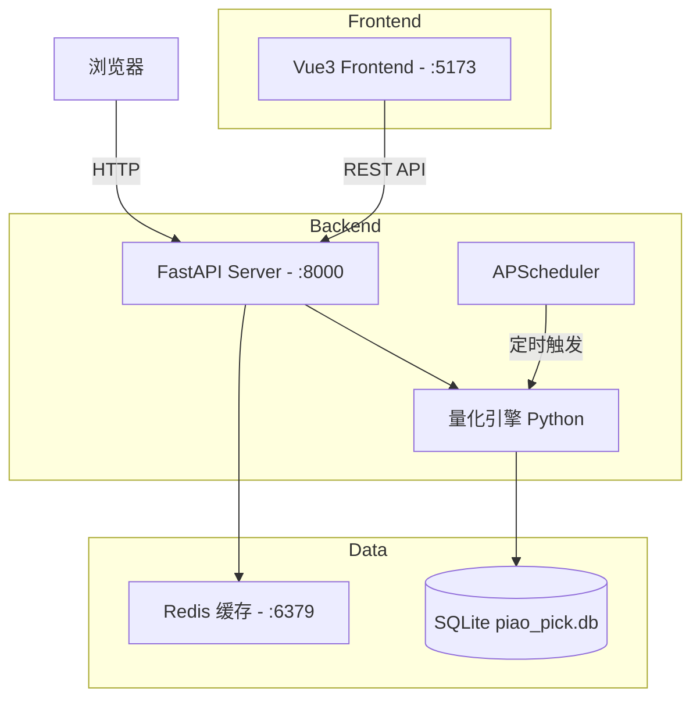
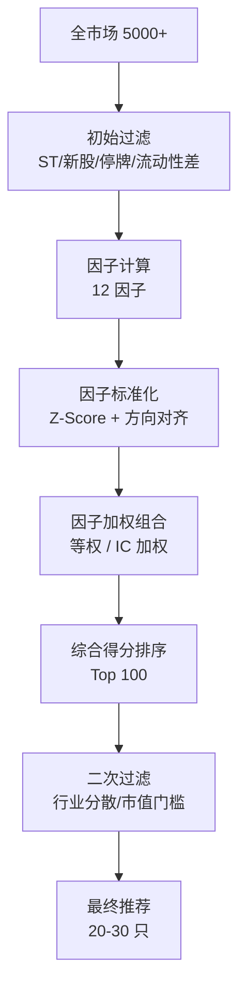

# 飘票选股系统 - 技术架构方案

> 版本: v1.0 | 日期: 2026-05-27
> 状态: Draft, Pending Review

---

## 目录

1. [系统定位与边界](#1-系统定位与边界)
2. [整体架构](#2-整体架构)
3. [技术栈](#3-技术栈)
4. [数据层设计](#4-数据层设计)
5. [选股引擎设计](#5-选股引擎设计)
6. [前端架构 (Vue3)](#6-前端架构-vue3)
7. [API 设计](#7-api-设计)
8. [开发路线图](#8-开发路线图)
9. [关键风险与缓解](#9-关键风险与缓解)
10. [目录结构](#10-目录结构)

---

## 1. 系统定位与边界

### 1.1 一句话定义

飘票选股系统是一个**量化信号发现工具**：从 A 股全市场 5000+ 只股票中，按可量化的多因子规则，筛选出符合特定条件的候选股票池。

### 1.2 核心能力（做什么）

| 能力 | 说明 |
|---|---|
| 数据采集与管理 | 定时拉取行情/财务/资金数据，清洗对齐存储 |
| 多因子计算 | 12+ 因子的计算、标准化、截面排名 |
| 策略驱动选股 | YAML 声明式策略配置，不改代码即可调整策略 |
| 选股结果展示 | 表格 + 雷达图 + 行业分布，可视化辅助决策 |
| 简单回测 | 验证因子有效性，评估策略历史表现 |

### 1.3 不做的事

| 不做 | 原因 |
|---|---|
| 交易执行（下单/撤单/仓位） | 属于券商交易系统，不在选股范畴 |
| 实时毫秒级风控 | 选股是 T+1 日级决策支持，非高频场景 |
| 组合优化（均值-方差等） | 选股输出候选池，仓位分配是下一个环节 |
| 自动化信号推送 | MVP 阶段保持"系统筛，人确认"的模式 |

### 1.4 典型用户场景

- **独立投资者**：周末 30 分钟，系统筛全市场，人工核查 20-30 只候选，确定下周关注池
- **量化爱好者**：有策略想法，快速验证因子有效性
- **小私募研究员**：每日更新股票池，替代手工筛选流程

---

## 2. 整体架构

### 2.1 架构风格：模块化单体

不做微服务。项目面向个人/小团队，单体足够。通过清晰的模块边界保持可维护性。



### 2.2 数据流

```
15:00 收盘
    ↓
[数据管道] AKShare 拉取当日行情
    ↓
[清洗] 处理停牌/新股/复权，增量 UPSERT 入 SQLite
    ↓
[因子引擎] 全市场 12 因子计算，Z-Score 标准化
    ↓
[选股引擎] 读取 YAML 策略配置，加权打分，过滤输出
    ↓
[API 层] FastAPI 提供 REST 接口
    ↓
[前端] Vue3 展示结果表格 + 雷达图 + K 线图
```

---

## 3. 技术栈

### 3.1 前端

| 技术 | 版本 | 用途 |
|---|---|---|
| Vue 3 | 3.5+ | UI 框架，Composition API |
| TypeScript | 5.x | 类型安全 |
| Vite | 6.x | 构建工具 |
| TailwindCSS | v4 | 原子化样式 |
| Naive UI | 2.x | 组件库（dark mode 开箱即用） |
| vue-echarts | 7.x | ECharts Vue3 封装 |
| Vue Router | 4.x | 路由 |
| Pinia | 2.x | 状态管理 |
| @fontsource/geist | - | 字体自托管（数字等宽用 Geist Mono） |

### 3.2 后端

| 技术 | 版本 | 用途 |
|---|---|---|
| Python | 3.11+ | 主要语言（量化生态） |
| FastAPI | 0.110+ | REST API 框架 |
| pandas + numpy | - | 数据处理核心 |
| scipy + statsmodels | - | 统计分析 |
| AKShare | 最新 | A 股数据源（主力） |
| SQLModel / SQLAlchemy | 2.0 | ORM |
| APScheduler | 3.x | 定时任务调度 |
| Redis | 7.x | 缓存（可选，MVP 先用 Python LRU） |

### 3.3 数据存储

| 技术 | 用途 |
|---|---|
| SQLite | 关系数据 + 时序数据，单文件零部署 |
| Redis (可选) | 热数据缓存 |

### 3.4 部署

| 技术 | 用途 |
|---|---|
| Docker Compose | 容器化本地部署 |
| Nginx | 生产环境反向代理（可选） |

---

## 4. 数据层设计

### 4.1 数据源策略

```
主力: AKShare (免费，Python 原生)
  ├── 实时行情: 东方财富/新浪接口
  ├── 历史 K 线: 日/周/月线，前复权数据
  ├── 财务数据: 三大报表、财务指标
  ├── 资金流向: 个股/板块资金流
  └── 缺点: 接口不稳定，偶有字段变更

备线: TuShare (注册获取 token)
  ├── 接口更稳定
  ├── 作为 AKShare 失败时的 fallback
  └── 部分数据需要积分
```

### 4.2 数据库 Schema

#### 4.2.1 股票基础信息

```sql
CREATE TABLE stock_info (
    ts_code      TEXT PRIMARY KEY,   -- '000001.SZ'
    name         TEXT,               -- '平安银行'
    industry     TEXT,               -- '银行' (申万一级行业)
    list_date    TEXT,               -- 上市日期 'YYYY-MM-DD'
    is_st        INTEGER DEFAULT 0, -- 是否 ST/ *ST
    is_suspended INTEGER DEFAULT 0, -- 是否停牌
    updated_at   TEXT               -- 最后更新时间
);
```

#### 4.2.2 日 K 线数据

```sql
CREATE TABLE kline_daily (
    ts_code      TEXT NOT NULL,
    trade_date   TEXT NOT NULL,
    open         REAL,
    high         REAL,
    low          REAL,
    close        REAL,
    volume       INTEGER,           -- 成交量 (股)
    amount       REAL,              -- 成交额 (元)
    close_adj    REAL,              -- 前复权价 (关键!)
    adj_factor   REAL,              -- 复权因子
    is_limit_up  INTEGER DEFAULT 0, -- 当日涨停
    is_limit_down INTEGER DEFAULT 0,-- 当日跌停
    PRIMARY KEY (ts_code, trade_date)
);

CREATE INDEX idx_kline_date ON kline_daily(trade_date);
CREATE INDEX idx_kline_code ON kline_daily(ts_code);
```

#### 4.2.3 日因子数据

```sql
CREATE TABLE factor_daily (
    ts_code        TEXT NOT NULL,
    trade_date     TEXT NOT NULL,
    -- 估值因子
    pe_ttm         REAL,   -- 市盈率 (TTM)
    pb             REAL,   -- 市净率
    ps_ttm         REAL,   -- 市销率 (TTM)
    fcf_yield      REAL,   -- 自由现金流收益率
    -- 动量因子
    ret_20d        REAL,   -- 20 日涨跌幅
    ret_60d_vol    REAL,   -- 60 日波动率
    turnover_20d   REAL,   -- 20 日换手率
    -- 质量因子
    roe_ttm        REAL,   -- 净资产收益率 (TTM)
    gross_margin   REAL,   -- 毛利率
    -- 成长因子
    rev_growth_yoy REAL,   -- 营收同比增长
    ear_growth_yoy REAL,   -- 净利润同比增长
    -- 其他
    ln_market_cap  REAL,   -- 对数流通市值
    inst_holding_chg REAL, -- 机构持仓变化率
    -- 扩展字段
    extra          JSON,   -- 自定义因子暂存
    PRIMARY KEY (ts_code, trade_date)
);

CREATE INDEX idx_factor_date ON factor_daily(trade_date);
```

#### 4.2.4 选股策略

```sql
CREATE TABLE strategies (
    id           TEXT PRIMARY KEY,  -- UUID
    name         TEXT,              -- '价值低波'
    description  TEXT,              -- '低估值 + 低波动 + 高质量'
    config       TEXT NOT NULL,     -- YAML 配置内容
    is_active    INTEGER DEFAULT 1,
    created_at   TEXT,
    updated_at   TEXT
);
```

#### 4.2.5 选股结果

```sql
CREATE TABLE selection_results (
    strategy_id  TEXT,
    ts_code      TEXT,
    trade_date   TEXT,
    rank         INTEGER,           -- 排名
    composite_score REAL,           -- 综合得分 (0-100)
    status       TEXT,              -- 'OK', 'LIMIT_UP', 'SUSPENDED'
    factor_snapshot JSON,           -- 当日因子快照
    created_at   TEXT,
    PRIMARY KEY (strategy_id, ts_code, trade_date),
    FOREIGN KEY (strategy_id) REFERENCES strategies(id)
);
```

### 4.3 数据更新流程

```python
# 伪代码
async def daily_update_pipeline(trade_date: str):
    if not is_trade_day(trade_date):
        return

    # Step 1: 增量拉取当日行情
    kline_data = fetch_daily_kline(trade_date)

    # Step 2: 数据校验
    assert len(kline_data) >= 4800, f"数据量异常: {len(kline_data)} 条"

    # Step 3: 清洗处理
    kline_data = process_kline(kline_data)
    # - 标记 is_suspended (停牌)
    # - 标记 is_limit_up / is_limit_down
    # - 计算 close_adj (前复权)

    # Step 4: UPSERT 入库
    upsert_kline_daily(kline_data)
    upsert_stock_info(update_st_status=True)

    # Step 5: 因子全量重算 (当日截面)
    factors = compute_all_factors(trade_date)
    # - 极值处理 (Winsorize ±3σ)
    # - 缺失值填充 (行业均值)
    # - Z-Score 标准化
    upsert_factor_daily(factors)

    # Step 6: 触发所有活跃策略
    for strategy in get_active_strategies():
        results = run_strategy(strategy, trade_date, factors)
        save_selection_results(results)

    # Step 7: 异常检测与告警
    validate_data_integrity(trade_date)
```

### 4.4 数据清洗铁律

| 规则 | 处理方式 |
|---|---|
| 复权 | 统一使用**前复权** (close_adj) |
| 停牌 | open=high=low=close=前日收盘价, 标记 `is_suspended=1` |
| ST 标记 | `stock_info.is_st=1`, 策略默认排除 |
| 新股剔除 | 上市不满 60 个交易日，不参与因子排名 |
| 涨跌停 | 标记 flag，选股结果标注"不可买入" |
| PE<0 (亏损) | 不参与 PE 截面排名，单独分类 |
| 未来数据 | 严格使用 `trade_date` 为截止点，不使用未来发布的财报 |

---

## 5. 选股引擎设计

### 5.1 多因子模型流程



### 5.2 MVP 因子池

共 12 个经过学术和实证验证的因子，按类别：

| 类别 | 因子 ID | 因子名称 | 计算公式 | 方向 |
|---|---|---|---|---|
| **估值** | pe_ttm | 市盈率 TTM | 总市值 / 归属净利润 TTM | 负向 (低估值) |
| **估值** | pb | 市净率 | 总市值 / 归属净资产 | 负向 |
| **估值** | ps_ttm | 市销率 TTM | 总市值 / 营业收入 TTM | 负向 |
| **估值** | fcf_yield | 自由现金流收益率 | 自由现金流 / 总市值 | 正向 |
| **动量** | ret_20d | 20 日动量 | (close_t - close_{t-20}) / close_{t-20} | 正向 |
| **动量** | ret_60d_vol | 60 日波动率 | 60 日收益率标准差 | 负向 (低波动) |
| **动量** | turnover_20d | 20 日换手率 | 20 日平均换手率 | 负向 (低换手) |
| **质量** | roe_ttm | 净资产收益率 TTM | 净利润 TTM / 净资产 | 正向 |
| **质量** | gross_margin | 毛利率 | (营收 - COGS) / 营收 | 正向 |
| **成长** | rev_growth_yoy | 营收同比增长 | (营收 - 去年营收) / 去年营收 | 正向 |
| **成长** | ear_growth_yoy | 净利润同比增长 | (净利润 - 去年净利润) / 去年净利润 | 正向 |
| **规模** | ln_market_cap | 对数流通市值 | ln(流通市值) | 负向 (小市值) |

### 5.3 因子处理管道

```python
import numpy as np
import pandas as pd

class FactorPipeline:
    """因子计算与标准化管道"""

    @staticmethod
    def winsorize(series: pd.Series, limits: tuple = (-3, 3)) -> pd.Series:
        """极值处理: 超过 ±3σ 的值压缩到边界"""
        mean, std = series.mean(), series.std()
        lower = mean + limits[0] * std
        upper = mean + limits[1] * std
        return series.clip(lower=lower, upper=upper)

    @staticmethod
    def z_score(series: pd.Series) -> pd.Series:
        """Z-Score 标准化: 均值 0, 标准差 1"""
        return (series - series.mean()) / series.std()

    @staticmethod
    def align_direction(series: pd.Series, direction: str) -> pd.Series:
        """方向对齐: 确保所有因子越大越好"""
        if direction == 'negative':
            return -series
        return series

    def process(
        self, raw_factors: pd.DataFrame, factor_config: list
    ) -> pd.DataFrame:
        """
        完整因子处理流程

        Args:
            raw_factors: 原始因子截面数据, index=ts_code
            factor_config: 因子配置列表, 包含 id/weight/direction
        """
        processed = pd.DataFrame(index=raw_factors.index)

        for cfg in factor_config:
            fid = cfg['id']
            direction = cfg.get('direction', 'positive')

            if fid not in raw_factors.columns:
                continue

            col = raw_factors[fid].copy()

            # 1. 极值处理
            col = self.winsorize(col)

            # 2. 缺失值填充 (行业均值 > 全市场均值)
            col = col.fillna(col.mean())

            # 3. 标准化
            col = self.z_score(col)

            # 4. 方向对齐
            col = self.align_direction(col, direction)

            processed[fid] = col

        return processed
```

### 5.4 策略配置格式 (YAML)

```yaml
# strategies/value_lowvol.yaml
strategy:
  id: "value-lowvol-v1"
  name: "价值低波"
  description: "低估值 + 低波动 + 高质量，适合震荡市"
  version: "1.0"

universe:
  exclude_st: true
  exclude_new_listing_days: 60
  exclude_suspended: true
  min_market_cap: 2000000000     # 20 亿 (剔除壳股)
  min_daily_amount: 5000000      # 日均成交额 > 500 万

factors:
  - id: pe_ttm
    weight: 0.20
    direction: negative          # 越低越好
  - id: pb
    weight: 0.15
    direction: negative
  - id: roe_ttm
    weight: 0.20
    direction: positive
  - id: ret_60d_vol
    weight: 0.20
    direction: negative
  - id: gross_margin
    weight: 0.15
    direction: positive
  - id: turnover_20d
    weight: 0.10
    direction: negative

filters:
  - type: percentile_top
    count: 100                   # 取综合得分前 100
  - type: industry_diversify
    max_per_industry: 5          # 单行业最多 5 只
  - type: market_cap_min
    value: 2000000000            # 市值 > 20 亿

output:
  max_stocks: 30                 # 最终输出数量
  sort_by: composite_score
  sort_order: desc
```

### 5.5 回测框架设计

#### 核心逻辑

```python
async def run_backtest(strategy_config: dict, start_date: str, end_date: str):
    """
    月度调仓回测

    Args:
        strategy_config: 策略 YAML 解析后的配置
        start_date: 回测起始日期 'YYYY-MM-DD'
        end_date: 回测结束日期 'YYYY-MM-DD'
    """
    # 获取调仓日列表 (每月最后一个交易日)
    rebalance_dates = get_monthly_rebalance_dates(start_date, end_date)

    portfolio_history = []
    benchmark_prices = get_benchmark_prices('000300.SH', start_date, end_date)

    for i, rdate in enumerate(rebalance_dates[:-1]):
        # 1. 获取当日数据快照 (不能使用 rdate 之后的数据!)
        snapshot_date = rdate
        factors_snapshot = get_factors(snapshot_date)
        kline_snapshot = get_kline(snapshot_date)

        # 2. 执行策略筛选
        selected_stocks = run_strategy_selection(
            strategy_config, factors_snapshot, kline_snapshot
        )

        # 3. 等权买入 selected_stocks
        buy_date = get_next_trade_date(rdate)  # T+1 买入
        entry_prices = get_open_prices(selected_stocks, buy_date)

        # 4. 持有至下一调仓日
        next_rdate = rebalance_dates[i + 1]
        exit_prices = get_close_prices(selected_stocks, next_rdate)

        # 5. 计算区间收益
        period_return = (
            (np.array(list(exit_prices.values())) /
             np.array(list(entry_prices.values()))) - 1
        ).mean()

        portfolio_history.append({
            'date': rdate,
            'return': period_return,
            'stocks': selected_stocks,
            'entry_prices': entry_prices,
            'exit_prices': exit_prices
        })

    # 6. 计算净值曲线
    nav = [1.0]
    for ph in portfolio_history:
        nav.append(nav[-1] * (1 + ph['return']))

    return BacktestResult(
        nav=nav,
        dates=[ph['date'] for ph in portfolio_history],
        portfolio_history=portfolio_history,
        benchmark_nav=benchmark_nav
    )
```

#### 回测输出指标

| 指标 | 计算方法 | 用途 |
|---|---|---|
| 年化收益率 | `(final_nav / initial_nav) ^ (252 / trading_days) - 1` | 绝对收益评估 |
| 年化波动率 | `std(daily_returns) * sqrt(252)` | 风险评估 |
| 夏普比率 | `(annual_return - risk_free_rate) / annual_volatility` | 风险调整后收益 |
| 最大回撤 | `max(1 - nav / cummax_nav)` | 最大亏损幅度 |
| Calmar 比率 | `annual_return / max_drawdown` | 收益与回撤之比 |
| 月度胜率 | `count(monthly_return > 0) / total_months` | 稳定性 |
| 换手率 | `平均每次调仓换股比例` | 交易成本评估 |
| IC 均值 | `因子值与下期收益的截面相关系数均值` | 因子预测能力 |
| ICIR | `IC_mean / IC_std` | 因子稳定性 |

---

## 6. 前端架构 (Vue3)

### 6.1 Design Read

> 个人量化分析工具，面向独立投资者。Data-dense dashboard 风格，强调数据可读性。克制配色，高数据密度，暗色模式优先。

### 6.2 设计三档

| Dial | 值 | 原因 |
|---|---|---|
| Design Variance | 5 | 数据分析工具，布局需克制稳定 |
| Motion Intensity | 3 | 不需要复杂动画，hover/active 状态足够 |
| Visual Density | 7 | 股票表格、因子雷达图需紧凑展示 |

### 6.3 配色方案

```
主色 (中性强调):    #3B82F6  蓝   -- 按钮、链接、active 状态
涨 (A 股惯例):       #EF4444  红   -- 涨幅、正收益
跌 (A 股惯例):       #22C55E  绿   -- 跌幅、负收益

暗色模式基础:
  背景底板:          #09090B (zinc-950)
  卡片/区块:         #18181B (zinc-900)
  分隔线:            #27272A (zinc-800)
  主要文本:          #FAFAFA
  次要文本:          #A1A1AA

亮色模式基础:
  背景底板:          #FAFAFA (zinc-50)
  卡片/区块:         #FFFFFF
  分隔线:            #E4E4E7
  主要文本:          #18181B
  次要文本:          #71717A
```

### 6.4 字体

| 用途 | 字体 | 来源 |
|---|---|---|
| UI 文本 | Geist Sans | @fontsource/geist |
| 数字/数据 | Geist Mono | @fontsource/geist-mono |
| 中文 fallback | "PingFang SC", "Microsoft YaHei" | 系统 |

**CSS 变量:**
```css
:root {
  --font-sans: 'Geist Sans', 'PingFang SC', 'Microsoft YaHei', sans-serif;
  --font-mono: 'Geist Mono', 'Menlo', monospace;
}
```

### 6.5 组件规范

#### Corner Radius 全局锁定

| 组件类型 | 圆角 |
|---|---|
| 卡片 | 8px |
| 输入框 | 6px |
| 按钮 | 6px (非 pill) |
| 弹窗 | 12px |
| 标签/Badge | 4px |

#### 数字格式规范

```typescript
// 股票价格: 保留 2 位小数
formatPrice(price: number): string {
  return price.toFixed(2)
}

// 涨跌幅: +/- 符号 + 2 位小数 + %
formatPct(pct: number): string {
  const sign = pct >= 0 ? '+' : ''
  return `${sign}${pct.toFixed(2)}%`
}

// 成交额: 亿/万 自动切换
formatAmount(amount: number): string {
  if (amount >= 1e8) return `${(amount / 1e8).toFixed(2)}亿`
  if (amount >= 1e4) return `${(amount / 1e4).toFixed(0)}万`
  return amount.toFixed(0)
}

// 市值: 亿
formatMarketCap(amount: number): string {
  return `${(amount / 1e8).toFixed(1)}亿`
}
```

### 6.6 页面结构

#### 6.6.1 布局骨架

```vue
<template>
  <NConfigProvider :theme="isDark ? darkTheme : lightTheme">
    <NLayout class="min-h-screen">
      <NLayoutHeader bordered>
        <!-- 顶栏: Logo + 导航 + 主题切换 -->
      </NLayoutHeader>

      <NLayout has-sider>
        <NLayoutSider bordered :width="200">
          <!-- 侧边栏: 策略列表 / 快速操作 -->
        </NLayoutSider>

        <NLayoutContent>
          <!-- 主内容区域: RouterView -->
        </NLayoutContent>
      </NLayout>
    </NLayout>
  </NConfigProvider>
</template>
```

#### 6.6.2 路由规划

| 路径 | 名称 | 功能 |
|---|---|---|
| `/` | SelectionHome | 选股主页，运行策略并展示结果 |
| `/strategy/:id` | StrategyEdit | 策略配置编辑 |
| `/strategy/list` | StrategyList | 策略列表管理 |
| `/stock/:ts_code` | StockDetail | 个股详情 (K 线 + 因子 + 财务) |
| `/backtest/:strategyId` | BacktestResult | 回测结果展示 |
| `/data/status` | DataStatus | 数据状态查看 (最近更新/缺失检查) |

#### 6.6.3 选股结果页 (核心页面)

```vue
<script setup lang="ts">
// 页面结构: 顶部操作栏 + 结果表格 + 右侧面板
</script>

<template>
  <div class="flex flex-col h-full">
    <!-- 顶部操作栏 -->
    <div class="flex items-center gap-4 p-4 border-b border-border">
      <n-select
        v-model:value="selectedStrategy"
        :options="strategies"
        placeholder="选择策略"
      />
      <span class="text-sm text-secondary">
        选股日期: <span class="font-mono">{{ tradeDate }}</span>
      </span>
      <n-button @click="runSelection" :loading="loading">
        运行选股
      </n-button>
      <div class="ml-auto text-sm text-secondary">
        <span class="font-mono">{{ results.length }}</span> 只候选
      </div>
    </div>

    <!-- 主体: 表格 + 右侧面板 -->
    <div class="flex flex-1 overflow-hidden">
      <!-- 左侧: 股票表格 -->
      <div class="flex-1 overflow-auto">
        <n-data-table
          :data="results"
          :columns="columns"
          :bordered="false"
          :single-line="false"
          virtual-scroll
          max-height="calc(100vh - 200px)"
          @row-click="handleStockSelect"
        />
      </div>

      <!-- 右侧: 选中股票详情面板 -->
      <StockDetailPanel
        v-if="selectedStock"
        :stock="selectedStock"
        class="w-80 border-l border-border"
      />
    </div>
  </div>
</template>
```

#### 6.6.4 表格列配置

```typescript
import type { DataTableColumns } from 'naive-ui'

interface StockRow {
  ts_code: string
  name: string
  industry: string
  composite_score: number
  close: number
  pct_change: number
  pe_ttm: number
  pb: number
  roe_ttm: number
  ret_20d: number
  market_cap: number
  status: string
}

const columns: DataTableColumns<StockRow> = [
  { title: '代码', key: 'ts_code', width: 100, render: renderTsCode },
  { title: '名称', key: 'name', width: 100 },
  { title: '行业', key: 'industry', width: 100 },
  { title: '得分', key: 'composite_score', width: 80,
    sorter: 'default', render: renderScore },
  { title: '现价', key: 'close', width: 90,
    render: renderPrice },
  { title: '涨跌', key: 'pct_change', width: 80,
    render: renderPctChange },
  { title: 'PE', key: 'pe_ttm', width: 80,
    render: renderFactor },
  { title: 'PB', key: 'pb', width: 80,
    render: renderFactor },
  { title: 'ROE', key: 'roe_ttm', width: 80,
    render: renderPct },
  { title: '动量20d', key: 'ret_20d', width: 90,
    render: renderPct },
  { title: '市值', key: 'market_cap', width: 90,
    render: renderMarketCap },
]
```

#### 6.6.5 个股详情页

```vue
<template>
  <div class="p-6 space-y-6">
    <!-- 头部: 股票名称 + 价格 + 涨跌 -->
    <StockHeader :stock="stock" />

    <!-- K线图区域 (ECharts candlestick) -->
    <div class="bg-card rounded-lg p-4">
      <KLineChart
        :ts-code="tsCode"
        :data="klineData"
        :indicators="['MA20', 'MA60', 'MACD']"
      />
    </div>

    <!-- 因子雷达图 + 财务指标 并排 -->
    <div class="grid grid-cols-2 gap-6">
      <div class="bg-card rounded-lg p-4">
        <FactorRadar :factors="stockFactors" />
      </div>
      <div class="bg-card rounded-lg p-4">
        <FinancialTrend :financials="stockFinancials" />
      </div>
    </div>

    <!-- 因子历史走势图 -->
    <div class="bg-card rounded-lg p-4">
      <FactorHistory :ts-code="tsCode" :factors="factorHistory" />
    </div>
  </div>
</template>
```

#### 6.6.6 K 线图组件

```vue
<script setup lang="ts">
import VChart from 'vue-echarts'
import { use } from 'echarts/core'
import { CandlestickChart, LineChart } from 'echarts/charts'
import { GridComponent, TooltipComponent, DataZoomComponent } from 'echarts/components'
import { CanvasRenderer } from 'echarts/renderers'

use([CandlestickChart, LineChart, GridComponent, TooltipComponent, DataZoomComponent, CanvasRenderer])

// K 线图选项
const chartOption = {
  animation: false,
  tooltip: { trigger: 'axis', axisPointer: { type: 'cross' } },
  grid: [
    { left: 60, right: 40, top: 20, height: '55%' },   // K 线
    { left: 60, right: 40, top: '70%', height: '25%' }  // 成交量
  ],
  xAxis: [
    { type: 'category', data: dates, gridIndex: 0 },    // K 线 X 轴
    { type: 'category', data: dates, gridIndex: 1 }     // 成交量 X 轴
  ],
  yAxis: [
    { scale: true, gridIndex: 0 },                       // 价格 Y 轴
    { scale: true, gridIndex: 1 }                        // 成交量 Y 轴
  ],
  dataZoom: [
    { type: 'inside', xAxisIndex: [0, 1], start: 70, end: 100 }
  ],
  series: [
    {
      type: 'candlestick',
      data: candlestickData,
      xAxisIndex: 0, yAxisIndex: 0,
      itemStyle: {
        color: '#EF4444',        // 涨 (红)
        color0: '#22C55E',       // 跌 (绿)
        borderWidth: 1
      }
    },
    { name: 'MA20', type: 'line', data: ma20, xAxisIndex: 0, yAxisIndex: 0 },
    { name: 'MA60', type: 'line', data: ma60, xAxisIndex: 0, yAxisIndex: 0 },
    { type: 'bar', data: volumeData, xAxisIndex: 1, yAxisIndex: 1 }
  ]
}
</script>

<template>
  <v-chart :option="chartOption" style="height: 400px" autoresize />
</template>
```

### 6.6.7 回测结果页

```vue
<template>
  <div class="p-6 space-y-6">
    <!-- 策略信息头部 -->
    <BacktestHeader :strategy="strategy" :period="period" />

    <!-- 净值曲线 (ECharts) -->
    <div class="bg-card rounded-lg p-4">
      <NavCurveChart
        :portfolio-nav="result.nav"
        :benchmark-nav="result.benchmarkNav"
        :dates="result.dates"
      />
    </div>

    <!-- 核心指标卡片 -->
    <div class="grid grid-cols-4 gap-4">
      <MetricCard label="年化收益" :value="formatPct(result.annualReturn)" />
      <MetricCard label="夏普比率" :value="result.sharpe.toFixed(2)" />
      <MetricCard label="最大回撤" :value="formatPct(result.maxDrawdown)" negative />
      <MetricCard label="月度胜率" :value="formatPct(result.monthlyWinRate)" />
    </div>

    <!-- 年度收益热力图 + 月度收益分布 -->
    <div class="grid grid-cols-2 gap-6">
      <div class="bg-card rounded-lg p-4">
        <YearlyHeatmap :yearly-returns="result.yearlyReturns" />
      </div>
      <div class="bg-card rounded-lg p-4">
        <MonthlyDistribution :monthly-returns="result.monthlyReturns" />
      </div>
    </div>
  </div>
</template>
```

---

## 7. API 设计

### 7.1 REST 端点

#### 股票数据

| 方法 | 路径 | 描述 |
|---|---|---|
| GET | `/api/stocks` | 获取股票列表 (支持分页 + 筛选) |
| GET | `/api/stocks/{ts_code}` | 获取单只股票详情 |
| GET | `/api/stocks/{ts_code}/kline` | 获取 K 线数据 |
| GET | `/api/stocks/{ts_code}/factors` | 获取因子历史数据 |
| GET | `/api/stocks/{ts_code}/financials` | 获取财务数据 |

#### 策略管理

| 方法 | 路径 | 描述 |
|---|---|---|
| GET | `/api/strategies` | 获取所有策略 |
| POST | `/api/strategies` | 创建策略 |
| GET | `/api/strategies/{id}` | 获取策略详情 |
| PUT | `/api/strategies/{id}` | 更新策略配置 |
| DELETE | `/api/strategies/{id}` | 删除策略 |

#### 选股执行

| 方法 | 路径 | 描述 |
|---|---|---|
| POST | `/api/selection/run` | 运行选股 (指定策略 + 日期) |
| GET | `/api/selection/results` | 获取历史选股结果 |
| GET | `/api/selection/results/{date}` | 获取指定日期的选股结果 |

#### 回测

| 方法 | 路径 | 描述 |
|---|---|---|
| POST | `/api/backtest/run` | 运行回测 |
| GET | `/api/backtest/{id}` | 获取回测结果 |
| GET | `/api/backtest/available-dates` | 获取可回测日期范围 |

#### 数据状态

| 方法 | 路径 | 描述 |
|---|---|---|
| GET | `/api/data/status` | 数据库状态 (行数/更新时间/数据缺失) |
| POST | `/api/data/sync` | 手动触发数据同步 |
| GET | `/api/data/trade-calendar` | 获取交易日历 |

### 7.2 关键接口详细设计

#### POST /api/selection/run

**Request:**
```json
{
  "strategy_id": "uuid-string",
  "trade_date": "2026-05-27",
  "recompute": false
}
```

**Response:**
```json
{
  "success": true,
  "data": {
    "trade_date": "2026-05-27",
    "strategy_name": "价值低波",
    "universe_count": 4872,
    "filtered_count": 4618,
    "candidate_count": 100,
    "final_count": 28,
    "results": [
      {
        "rank": 1,
        "ts_code": "600519.SH",
        "name": "贵州茅台",
        "industry": "食品饮料",
        "composite_score": 92.3,
        "status": "OK",
        "close": 1680.00,
        "pct_change": 1.25,
        "pe_ttm": 28.1,
        "pb": 8.5,
        "roe_ttm": 32.4,
        "market_cap": 2110000000000,
        "factor_snapshot": {
          "pe_ttm": -1.23,
          "pb": -0.87,
          "roe_ttm": 1.45
        }
      }
    ]
  }
}
```

#### POST /api/backtest/run

**Request:**
```json
{
  "strategy_id": "uuid-string",
  "start_date": "2020-01-01",
  "end_date": "2025-12-31",
  "rebalance_frequency": "monthly"
}
```

**Response:**
```json
{
  "success": true,
  "data": {
    "strategy_name": "价值低波",
    "period": {
      "start": "2020-01-01",
      "end": "2025-12-31",
      "trading_days": 1460
    },
    "metrics": {
      "annual_return": 0.187,
      "annual_volatility": 0.165,
      "sharpe_ratio": 1.42,
      "max_drawdown": -0.224,
      "calmar_ratio": 0.83,
      "monthly_win_rate": 0.62,
      "avg_turnover": 0.45,
      "total_return": 1.86
    },
    "benchmark_metrics": {
      "annual_return": 0.045,
      "sharpe_ratio": 0.32,
      "max_drawdown": -0.356
    },
    "nav_series": [
      {"date": "2020-01-31", "value": 1.000},
      {"date": "2020-02-29", "value": 1.012},
      {"date": "2020-03-31", "value": 0.987}
    ],
    "benchmark_nav_series": [
      {"date": "2020-01-31", "value": 1.000},
      {"date": "2020-02-29", "value": 0.985},
      {"date": "2020-03-31", "value": 0.921}
    ],
    "yearly_returns": {
      "2020": 0.234,
      "2021": 0.156,
      "2022": -0.087,
      "2023": 0.215,
      "2024": 0.198,
      "2025": 0.145
    },
    "monthly_returns": [
      {"month": "2020-01", "return": 0.032},
      {"month": "2020-02", "return": -0.012}
    ]
  }
}
```

---

## 8. 开发路线图

### Phase 1: MVP 数据基础 (Week 1)

**目标**: 搭建基础设施，完成数据管道闭环。

| 任务 | 技术栈 | 预计工时 |
|---|---|---|
| Docker Compose 配置 (Python + SQLite + Redis) | Docker | 0.5d |
| FastAPI 项目脚手架 + 健康检查接口 | Python + FastAPI | 0.5d |
| SQLite Schema 实现 + ORM 模型 | SQLModel | 0.5d |
| AKShare 数据拉取模块 (日 K 线 + 股票信息) | AKShare | 1d |
| 数据清洗管道 (复权/停牌/ST 处理) | pandas | 1d |
| 增量更新逻辑 + UPSERT | SQLModel | 0.5d |
| 交易日历 + 手动触发同步接口 | APScheduler | 0.5d |
| 数据完整性校验检查 | Python | 0.5d |

**里程碑**: 能稳定拉取 5000+ 只股票的日 K 线，数据干净可用。

### Phase 2: MVP 因子与选股 (Week 2)

**目标**: 实现多因子选股核心逻辑。

| 任务 | 技术栈 | 预计工时 |
|---|---|---|
| 12 个 MVP 因子计算模块 | pandas + numpy | 2d |
| 因子处理管道 (极值/缺失值/标准化/方向对齐) | pandas + scipy | 1d |
| YAML 策略加载与解析引擎 | PyYAML | 0.5d |
| 选股执行引擎 (加权打分 + 过滤) | Python | 1d |
| 选股结果持久化 + 查询 API | SQLModel + FastAPI | 0.5d |
| APScheduler 定时选股任务 | APScheduler | 0.5d |

**里程碑**: 能按 YAML 策略配置，每日收盘后自动输出 20-30 只候选股票。

### Phase 3: MVP 前端展示 (Week 3)

**目标**: Vue3 前端可视化选股结果。

| 任务 | 技术栈 | 预计工时 |
|---|---|---|
| Vue3 + Vite 项目脚手架 + Naive UI + 路由配置 | Vue 3 | 0.5d |
| 布局骨架 (顶栏 + 侧边栏 + 内容区) | TailwindCSS + Naive UI | 0.5d |
| 策略列表页 + 策略选择下拉 | Vue 3 | 0.5d |
| 选股结果表格 (虚拟滚动 + 排序 + 筛选) | Naive UI | 1d |
| 因子雷达图 (右侧面板) | ECharts + vue-echarts | 0.5d |
| 行业分布饼图 | ECharts | 0.5d |
| 涨跌颜色/数字格式化组件 | Vue 3 | 0.5d |
| 暗色/亮色模式切换 | Naive UI | 0.5d |
| 选股结果 API 对接 + Loading/Empty/Error 三态 | Pinia | 0.5d |

**里程碑**: 打开浏览器能看到当日选股结果表格，点击行能看到因子雷达图。

### Phase 4: 回测验证 (Week 4-5)

**目标**: 实现历史回测，验证策略有效性。

| 任务 | 技术栈 | 预计工时 |
|---|---|---|
| 月度调仓回测引擎 | pandas + numpy | 2d |
| 回测指标计算 (夏普/回撤/胜率/IC 等) | scipy + numpy | 1d |
| 回测结果 API | FastAPI | 0.5d |
| 净值曲线图 (策略 vs 沪深 300) | ECharts | 1d |
| 核心指标卡片 (MetricCard 组件) | Vue 3 | 0.5d |
| 年度收益热力图 | ECharts | 0.5d |
| 月度收益分布图 | ECharts | 0.5d |
| 回测页面 (Vue3 路由 + 状态管理) | Pinia | 1d |

**里程碑**: 能回测 5 年历史，看到策略 vs 基准的净值曲线和各项风险指标。

### Phase 5: 个股详情 (Week 6)

**目标**: 完善个股分析功能。

| 任务 | 技术栈 | 预计工时 |
|---|---|---|
| 个股详情页路由 + 基础布局 | Vue 3 | 0.5d |
| K 线图组件 (candlestick + 均线 + 成交量) | ECharts | 1.5d |
| 技术指标叠加 (MACD/RSI/KDJ) | ECharts | 1d |
| 因子历史走势图 (多因子折线图) | ECharts | 0.5d |
| 财务指标趋势图 (营收/利润/毛利率) | ECharts | 0.5d |
| 个股详情 API | FastAPI | 0.5d |
| 从选股结果页跳转到个股详情 | Vue Router | 0.5d |

**里程碑**: 点击候选股票能看到完整的 K 线图和因子分析。

### Phase 6: 策略增强 (Week 7-8)

**目标**: 扩展策略能力。

| 任务 | 技术栈 | 预计工时 |
|---|---|---|
| 策略编辑器 (因子权重拖拽调节) | Vue 3 + Slider | 1.5d |
| 策略 CRUD API | FastAPI | 0.5d |
| 多策略并行框架 | Python | 1d |
| 行业轮动策略模块 | Python | 1.5d |
| 用户自定义因子函数 | Python + AST | 1.5d |
| 多策略对比分析 (净值叠加图) | ECharts | 1d |

### Phase 7: 体验优化 (持续迭代)

- 选股日报自动推送 (微信/钉钉)
- 股票预警监控 (价格突破/均线交叉)
- 多策略赛马机制 (虚拟盘排名)
- 回测报告导出 (PDF/Excel)
- 数据缺失自动检测与重新拉取
- 性能监控 (选股执行时间/数据库查询时间)

---

## 9. 关键风险与缓解

### 9.1 数据风险

| 风险 | 严重度 | 缓解措施 |
|---|---|---|
| 未来函数 (用了未来数据) | 致命 | 强制使用 trade_date 作为数据截止点，回测时逐日检查数据快照可得性 |
| 幸存者偏差 (退市股消失) | 高 | 维护完整历史成分股列表，回测时包含退市股 |
| 前复权失真 (早期价格失真) | 中 | 监控 close_adj < 0，超过 5 年前复权数据交叉校验 |
| 财务数据延迟 (年报 3 月出) | 高 | 因子计算引入"数据可得日期" (财报实际发布日期) |
| 停牌股静默 (复牌后跳空) | 中 | 停牌日继承前值 + 标记 is_suspended + 选股排除 |
| 涨跌停不可交易 | 中 | 选股结果当天标记 is_limit_up，提示"建议次日观察" |
| AKShare 接口不稳定 | 高 | TuShare 作为 fallback，数据拉取失败重试 3 次 |

### 9.2 技术风险

| 风险 | 严重度 | 缓解措施 |
|---|---|---|
| 因子计算性能 (5000 x 12 因子) | 中 | pandas 向量化，按行业分组计算 |
| 回测性能 (10 年月度调仓) | 中 | 多进程并行 (每核心跑一个年度区间) |
| SQLite 并发写入 | 低 | 数据更新单线程，MVP 够用 |
| 数据量膨胀 (>5 年) | 低 | 监控数据增长，必要时迁移 PostgreSQL + TimescaleDB |

### 9.3 量化常见坑

| 坑 | 表现 | 解决方案 |
|---|---|---|
| 回测过拟合 | 策略在历史数据上漂亮，实盘失效 | Out-of-sample 测试，训练集/测试集分离 |
| 因子拥挤 | 多个投资者使用相同因子，alpha 消失 | 监控因子 IC 衰减趋势 |
| 小市值陷阱 | 小市值因子收益高但流动性差 | 设置流动性门槛 (日均成交额 > 500万) |
| 交易成本被忽略 | 回测收益被手续费吃掉 | 计算换手率，预留 0.3% 交易成本 |

---

## 10. 目录结构

```
piao-pick/
├── .gitignore
├── docker-compose.yml
├── README.md
│
├── backend/
│   ├── app/
│   │   ├── __init__.py
│   │   ├── main.py                    # FastAPI 入口
│   │   ├── config.py                  # 配置管理 (环境变量)
│   │   ├── database.py                # SQLite 连接池 + Session
│   │   │
│   │   ├── api/
│   │   │   ├── __init__.py
│   │   │   ├── router.py              # 路由汇总
│   │   │   ├── stocks.py              # 股票数据接口
│   │   │   ├── strategies.py          # 策略 CRUD
│   │   │   ├── selection.py           # 选股执行
│   │   │   ├── backtest.py            # 回测接口
│   │   │   └── data_status.py         # 数据状态
│   │   │
│   │   ├── engine/
│   │   │   ├── __init__.py
│   │   │   ├── data/
│   │   │   │   ├── __init__.py
│   │   │   │   ├── fetcher.py         # AKShare/TuShare 数据拉取
│   │   │   │   ├── cleaner.py         # 数据清洗管道
│   │   │   │   ├── calendar.py        # 交易日历
│   │   │   │   └── updater.py         # 增量更新逻辑
│   │   │   │
│   │   │   ├── factor/
│   │   │   │   ├── __init__.py
│   │   │   │   ├── base.py            # FactorPipeline 基类
│   │   │   │   ├── value.py           # 估值因子 (PE/PB/PS/FCF)
│   │   │   │   ├── momentum.py        # 动量因子 (Ret/Vol/Turnover)
│   │   │   │   ├── quality.py         # 质量因子 (ROE/Gross_Margin)
│   │   │   │   ├── growth.py          # 成长因子 (Rev/Earnings)
│   │   │   │   └── size.py            # 规模因子 (Market_Cap)
│   │   │   │
│   │   │   ├── strategy/
│   │   │   │   ├── __init__.py
│   │   │   │   ├── loader.py          # YAML 加载与解析
│   │   │   │   ├── executor.py        # 策略执行引擎
│   │   │   │   └── filters.py         # 过滤规则实现
│   │   │   │
│   │   │   ├── backtest/
│   │   │   │   ├── __init__.py
│   │   │   │   ├── engine.py          # 回测引擎 (月度调仓)
│   │   │   │   ├── metrics.py         # 风险指标计算 (夏普/回撤等)
│   │   │   │   └── ic_analysis.py     # 因子 IC 分析
│   │   │   │
│   │   │   └── scheduler.py           # APScheduler 定时任务
│   │   │
│   │   └── models/
│   │       ├── __init__.py
│   │       ├── stock_info.py
│   │       ├── kline.py
│   │       ├── factor.py
│   │       ├── strategy.py
│   │       └── selection.py
│   │
│   ├── strategies/
│   │   ├── value_lowvol.yaml          # 价值低波策略
│   │   └── momentum_growth.yaml       # 动量成长策略
│   │
│   ├── tests/
│   │   ├── test_data_fetcher.py
│   │   ├── test_factor_pipeline.py
│   │   ├── test_strategy_executor.py
│   │   └── test_backtest_engine.py
│   │
│   ├── requirements.txt
│   └── Dockerfile
│
└── frontend/
    ├── index.html
    ├── package.json
    ├── vite.config.ts
    ├── tailwind.config.ts
    ├── tsconfig.json
    │
    ├── public/
    │   └── favicon.svg
    │
    └── src/
        ├── main.ts
        ├── App.vue
        ├── env.d.ts
        │
        ├── assets/
        │   └── styles/
        │       └── main.css              # Tailwind 全局样式
        │
        ├── composables/
        │   ├── use-selection.ts          # 选股相关组合式函数
        │   ├── use-strategy.ts           # 策略相关
        │   ├── use-backtest.ts           # 回测相关
        │   └── use-theme.ts              # 暗色模式切换
        │
        ├── stores/
        │   ├── selection.ts              # 选股结果状态 (Pinia)
        │   ├── strategy.ts               # 策略状态
        │   └── app.ts                    # 全局应用状态
        │
        ├── router/
        │   └── index.ts                  # Vue Router 配置
        │
        ├── api/
        │   ├── client.ts                 # Axios/fetch 封装
        │   ├── stocks.ts                 # 股票数据 API
        │   ├── strategies.ts             # 策略 API
        │   ├── selection.ts              # 选股 API
        │   └── backtest.ts               # 回测 API
        │
        ├── types/
        │   ├── stock.ts                  # 股票类型定义
        │   ├── strategy.ts               # 策略类型
        │   ├── selection.ts              # 选股结果类型
        │   └── backtest.ts               # 回测类型
        │
        ├── utils/
        │   ├── format.ts                 # 数字/价格/百分比格式化
        │   ├── chart-options.ts          # ECharts 选项生成器
        │   └── constants.ts              # 颜色/路由等常量
        │
        ├── components/
        │   ├── common/
        │   │   ├── StockHeader.vue       # 股票信息头部
        │   │   ├── MetricCard.vue        # 指标卡片
        │   │   └── FactorBadge.vue       # 因子徽章
        │   │
        │   ├── chart/
        │   │   ├── KLineChart.vue        # K 线图 (candlestick)
        │   │   ├── FactorRadar.vue       # 因子雷达图
        │   │   ├── NavCurveChart.vue     # 净值曲线图
        │   │   ├── IndustryPie.vue       # 行业分布饼图
        │   │   ├── YearlyHeatmap.vue     # 年度收益热力图
        │   │   └── MonthlyDistribution.vue # 月度收益分布
        │   │
        │   └── stock/
        │       ├── StockTable.vue        # 股票列表表格
        │       ├── StockDetailPanel.vue  # 右侧详情面板
        │       └── FinancialTrend.vue   # 财务趋势图
        │
        └── pages/
            ├── SelectionHome.vue         # 选股主页
            ├── StrategyList.vue          # 策略列表
            ├── StrategyEdit.vue          # 策略编辑
            ├── StockDetail.vue           # 个股详情
            ├── BacktestResult.vue        # 回测结果
            └── DataStatus.vue            # 数据状态
```

---

## Appendix A: 优先级原则

> **数据 > 因子 > 选股 > 回测 > 可视化 > 自动化 > 美化**

先把数据搞扎实，其他都是上层建筑。最怕回测曲线漂亮但数据是脏的。

## Appendix B: 核心原则

> **数据不脏，因子不乱，回测不骗自己。**

这个系统要做的不是找到"最好的股票"，而是**诚实地反映策略的真实表现**。

---

*文档完成，待 Momus 审查*